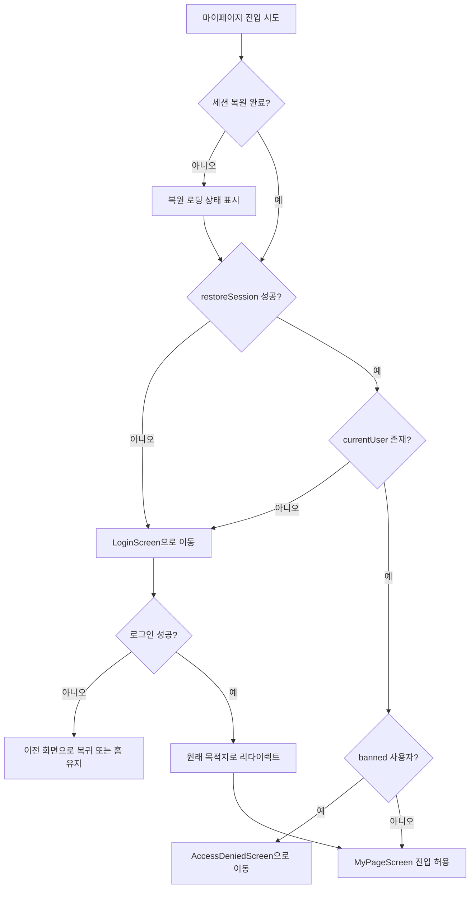

# ConCafe 구현 실행작업 백로그

기준 문서:
- [ConCafe_MVP_WBS_체크리스트.md](./ConCafe_MVP_WBS_%EC%B2%B4%ED%81%AC%EB%A6%AC%EC%8A%A4%ED%8A%B8.md)
- [UX plan.md](./UX%20plan.md)
- [# 🎀 ConCafe Firestore 컬렉션 다이어그램.md](./%23%20%F0%9F%8E%80%20ConCafe%20Firestore%20%EC%BB%AC%EB%A0%89%EC%85%98%20%EB%8B%A4%EC%9D%B4%EC%96%B4%EA%B7%B8%EB%9E%A8.md)
- [Maid_Cafe_Platform_Full_Project_Plan.md](./Maid_Cafe_Platform_Full_Project_Plan.md)

## 운영 규칙
- 우선순위: `P0(즉시)` / `P1(중요)` / `P2(후속)`
- 상태: `TODO` / `DOING` / `DONE`
- 각 작업은 완료 기준(AC: Acceptance Criteria)을 만족해야 DONE 처리

## A. 사전 확정 작업 (P0)

### A-01. 도메인 enum/스키마 최종 확정
- 우선순위: P0
- 상태: TODO
- 산출물: 스키마 결정표 문서 1부
- 작업:
  1. `conceptType` 허용값 최종 확정
  2. `events` 저장 위치(루트/서브컬렉션) 확정
  3. `favorites`, `visitHistory` 저장 전략 확정
- AC:
  - 클라이언트/백엔드가 동일한 필드 정의를 사용한다.
  - 모호한 필드가 0건이다.

### A-02. Firebase 보안 정책 초안 확정
- 우선순위: P0
- 상태: TODO
- 산출물: 역할별 권한 매트릭스
- 작업:
  1. USER/OWNER/ADMIN CRUD 범위 확정
  2. 리뷰 작성 선행조건(verified visit) 정책 확정
  3. 카페 승인 상태(`approved`) 노출 정책 확정
- AC:
  - 권한 정책 표에 예외 케이스가 명시된다.
  - 리뷰/체크인 관련 우회 경로가 없다.

### A-03. 인증 UX 정책 확정 (기획 반영)
- 우선순위: P0
- 상태: TODO
- 산출물: 인증 상태/라우팅 상태도 1부
- 작업:
  1. 앱 첫 실행 기본 진입을 홈으로 고정
  2. 비로그인(게스트) 허용 범위와 로그인 필요 범위 확정
  3. 마이 페이지 비로그인 진입 시 로그인 라우팅 규칙 확정
  4. 로그인 세션 유지/복원 정책 확정
- AC:
  - 홈/탐색/상세는 게스트 접근 가능하다.
  - 마이 페이지는 로그인 없이는 접근 불가하다.
  - 로그인 후 앱 재실행 시 세션이 유지된다.

### A-04. 로그인 필요 기능 매트릭스 확정
- 우선순위: P0
- 상태: TODO
- 산출물: 화면/액션별 로그인 요구표 1부
- 작업:
  1. 게스트 허용 기능과 로그인 필요 기능 분리
  2. 로그인 필요 기능 진입 시 공통 라우트 가드 적용 기준 확정
  3. 로그인 성공 후 복귀 대상(`pendingRoute`, `pendingAction`) 규칙 확정
- AC:
  - 즐겨찾기/팔로우/체크인/리뷰/좋아요/알림/마이페이지에 로그인 가드가 명시된다.
  - 비로그인 접근 시 동작이 모두 동일 정책(로그인 라우팅)으로 처리된다.

### A-05. 운영 환경/시크릿 정책 확정
- 우선순위: P0
- 상태: TODO
- 산출물: 환경 설정 표 + 시크릿 관리 정책서
- 작업:
  1. Firebase `dev/staging/prod` 프로젝트 분리
  2. 플랫폼별 환경값 주입 방식 확정(Android/iOS/Desktop)
  3. 시크릿 저장 위치와 접근 권한 정책 확정
- AC:
  - 로컬/스테이징/운영 환경이 혼용되지 않는다.
  - 저장소에 민감정보가 커밋되지 않는다.

### A-06. 관측/로그 정책 확정
- 우선순위: P0
- 상태: TODO
- 산출물: 이벤트 택소노미 + 로그 정책서
- 작업:
  1. 핵심 이벤트 정의(로그인, 체크인 성공/실패, 리뷰 작성, 팔로우)
  2. Crash/오류 수집 정책 확정
  3. 사용자 식별자/개인정보 마스킹 규칙 확정
- AC:
  - MVP 핵심 퍼널 지표를 추적할 수 있다.
  - 민감정보 로그 노출이 없다.

### A-07. 배포/롤백/브랜치 전략 확정
- 우선순위: P0
- 상태: TODO
- 산출물: 배포 체크리스트 + 롤백 절차서
- 작업:
  1. develop -> main 머지 조건 정의
  2. 릴리즈 태그/노트 규칙 확정
  3. Cloud Functions/Firebase Rules 롤백 절차 확정
- AC:
  - 장애 시 이전 안정 버전으로 복구 가능하다.
  - 릴리즈 단위 추적이 가능하다.

## B. 기반 구조 작업 (P0)

### B-01. shared 도메인 모델 정리
- 우선순위: P0
- 상태: TODO
- 산출물: 도메인 모델 목록/의존성 다이어그램
- 작업:
  1. User/Cafe/Cast/Visit/Review/Event 모델 정의
  2. 도메인 에러/결과 타입 통일
  3. UseCase 단위 인터페이스 분리
- AC:
  - UI 모듈이 도메인 타입만 참조한다.
  - 기능별 UseCase 책임이 겹치지 않는다.

### B-02. Repository 계약 정의
- 우선순위: P0
- 상태: TODO
- 산출물: Repository 인터페이스 명세서
- 작업:
  1. Auth/User/Cafe/Cast/Visit/Review/Notice 저장소 인터페이스 정의
  2. 페이지네이션/정렬/필터 파라미터 규격화
  3. 실패 케이스 표준화(네트워크/권한/검증 실패)
- AC:
  - 화면 요구사항을 모두 커버하는 메서드가 존재한다.
  - 중복 메서드가 없다.

### B-03. Firestore 인덱스/쿼리 계획
- 우선순위: P0
- 상태: TODO
- 산출물: 인덱스 목록 + 쿼리 대응표
- 작업:
  1. 탐색/랭킹/출근표/리뷰 조회 쿼리 확정
  2. 복합 인덱스 정의
  3. 예상 쿼리 비용 점검
- AC:
  - MVP 화면의 주요 쿼리가 인덱스 없이 실패하지 않는다.

## C. MVP 기능 작업 (P0-P1)

### C-01. 인증/프로필
- 우선순위: P0
- 상태: TODO
- 산출물: 게스트+로그인 전환 기반 프로필 플로우
- 작업:
  1. 앱 시작 시 홈 진입(비로그인 허용)
  2. 마이 페이지 진입 시 비로그인이면 로그인 화면 라우팅
  3. 로그인/로그아웃 처리 및 로그인 사용자 초기 유저 생성
  4. 프로필 조회/수정
  5. 차단 유저 접근 제한 처리
  6. 앱 재실행 시 세션 복원(자동 로그인)
- AC:
  - 로그인 없이 앱 첫 화면이 홈으로 열린다.
  - 비로그인 상태에서 마이 페이지 접근 시 로그인 화면으로 전환된다.
  - 로그인 후 앱 재실행해도 로그인 상태가 유지된다.
  - 프로필 수정 후 즉시 반영된다.

### C-02. 홈 탭
- 우선순위: P1
- 상태: TODO
- 산출물: 홈 화면(인기 메이드/근처 카페/생일/공지)
- 작업:
  1. 섹션별 데이터 소스 연결
  2. 로딩/에러/빈 상태 처리
  3. 카드 클릭 내비게이션 연결
- AC:
  - 4개 섹션이 모두 렌더링된다.
  - 섹션별 에러가 화면 전체를 망가뜨리지 않는다.

### C-03. 탐색 탭
- 우선순위: P0
- 상태: TODO
- 산출물: 카페/메이드 탐색
- 작업:
  1. 검색바 + 지역 필터 + 정렬
  2. 내부 탭(카페/메이드) 전환
  3. 페이징/무한 스크롤 처리
- AC:
  - 필터 조합 변경 시 결과가 일관되게 갱신된다.
  - 스크롤 성능 저하 없이 목록이 확장된다.

### C-04. 카페 상세
- 우선순위: P0
- 상태: TODO
- 산출물: 카페 상세(정보/메이드/메뉴/리뷰/공지)
- 작업:
  1. 상단 이미지/기본 정보/즐겨찾기
  2. 탭별 데이터 로드 분리
  3. 리뷰 진입 및 작성 연결
- AC:
  - 탭 전환 시 데이터가 정확히 표시된다.
  - 즐겨찾기 토글은 로그인 사용자만 즉시 반영된다.
  - 비로그인 즐겨찾기 시도 시 로그인 화면으로 라우팅된다.

### C-05. 메이드 상세
- 우선순위: P1
- 상태: TODO
- 산출물: 메이드 상세(프로필/소개/소속/출근표 영역)
- 작업:
  1. 메이드 기본 정보/이미지 표시
  2. 소속 카페 이동 링크
  3. 팔로우 버튼/상태 연결(비로그인 시 로그인 라우팅)
- AC:
  - 메이드 상세에서 카페 상세로 이동 가능하다.
  - 필수 정보 누락 시 대체 UI가 표시된다.
  - 비로그인 팔로우 시도 시 로그인 화면으로 라우팅된다.

### C-06. 체크인 + 방문 인증
- 우선순위: P0
- 상태: TODO
- 산출물: 체크인 플로우
- 작업:
  1. 카페 선택/날짜/메모 입력
  2. 위치 인증(100m) 검증 호출
  3. 방문 이력 저장 + 타임라인 반영
- AC:
  - 비로그인 체크인 시도 시 로그인 화면으로 라우팅된다.
  - 반경 밖 체크인은 실패 처리된다.
  - 성공 체크인은 즉시 방문 기록에 표시된다.

### C-07. 리뷰
- 우선순위: P0
- 상태: TODO
- 산출물: 리뷰 작성/조회
- 작업:
  1. 방문 인증 사용자만 작성 허용
  2. 별점/내용/이미지 업로드
  3. 최신순 정렬/카운트 반영
  4. 리뷰 좋아요/삭제 로그인 가드 적용
- AC:
  - 비로그인 리뷰 작성/좋아요/삭제 시도 시 로그인 화면으로 라우팅된다.
  - 미인증 사용자는 작성 버튼이 차단된다.
  - 작성 후 평균 평점/리뷰 수가 갱신된다.

### C-08. 마이 페이지
- 우선순위: P1
- 상태: TODO
- 산출물: 마이 페이지 기본
- 작업:
  1. 프로필/레벨/총 방문수
  2. 방문 기록 목록
  3. 즐겨찾기 카페 목록
- AC:
  - 비로그인 접근 시 로그인 화면으로 라우팅된다.
  - 로그인 성공 후 원래 요청한 마이 페이지로 복귀한다.
  - 사용자 기준 개인 데이터만 노출된다.

### C-09. 알림
- 우선순위: P1
- 상태: TODO
- 산출물: 알림 목록/읽음 처리
- 작업:
  1. 알림 목록 조회
  2. 읽음 처리
  3. 비로그인 접근 라우트 가드 적용
- AC:
  - 비로그인 알림 진입 시 로그인 화면으로 라우팅된다.
  - 로그인 사용자는 알림 조회/읽음 처리가 가능하다.

## D. 서버 검증/집계 작업 (P0)

### D-01. 리뷰 검증 함수
- 우선순위: P0
- 상태: TODO
- 산출물: 리뷰 검증 로직 명세 및 적용
- 작업:
  1. 리뷰 생성 시 `verified visit` 확인
  2. 실패 코드 표준화
- AC:
  - 조건 미충족 리뷰 생성이 100% 차단된다.

### D-02. 체크인 위치 검증 함수
- 우선순위: P0
- 상태: TODO
- 산출물: 체크인 검증 로직 명세 및 적용
- 작업:
  1. 카페 좌표-사용자 좌표 거리 계산
  2. 허용 반경(100m) 비교
- AC:
  - 거리 경계값 테스트가 통과한다.

### D-03. 집계 업데이트 함수
- 우선순위: P0
- 상태: TODO
- 산출물: 평점/리뷰수/팔로워수 집계 전략
- 작업:
  1. 리뷰 작성/삭제 시 평점, 카운트 갱신
  2. 팔로우/언팔로우 시 followerCount 갱신
- AC:
  - 집계 값이 원본 데이터와 불일치하지 않는다.

## E. 테스트/릴리즈 작업 (P2, MVP 구현 후)

### E-01. 도메인 테스트
- 우선순위: P2
- 상태: TODO
- 산출물: UseCase 단위 테스트 세트
- 작업:
  1. 체크인/리뷰/권한 시나리오 테스트
  2. 예외/실패 경로 테스트
- AC:
  - 핵심 유스케이스 정상/예외 경로가 모두 검증된다.

### E-02. 권한 시나리오 테스트
- 우선순위: P2
- 상태: TODO
- 산출물: USER/OWNER/ADMIN 규칙 검증 리포트
- 작업:
  1. 허용 요청/차단 요청 케이스 작성
  2. 룰 회귀 테스트
- AC:
  - 권한 누수 케이스가 0건이다.

### E-03. 스모크 테스트
- 우선순위: P2
- 상태: TODO
- 산출물: MVP 사용자 시나리오 체크 결과
- 작업:
  1. 홈→탐색→상세→체크인→리뷰 end-to-end 점검
  2. 오류 메시지/복구 동작 점검
- AC:
  - 핵심 플로우가 끊김 없이 완료된다.

### E-04. 보안 규칙 자동 테스트
- 우선순위: P2
- 상태: TODO
- 산출물: Firestore/Storage Rules 테스트 스위트
- 작업:
  1. USER/OWNER/ADMIN 허용/차단 케이스 자동화
  2. 리뷰 작성(verified visit 필요) 제약 테스트
- AC:
  - 배포 전 권한 회귀가 자동으로 검출된다.

### E-05. 딥링크/푸시 가드 테스트
- 우선순위: P2
- 상태: TODO
- 산출물: 보호 라우트 진입 테스트 리포트
- 작업:
  1. 비로그인 상태 딥링크 진입 시 로그인 유도 확인
  2. 로그인 성공 후 pendingRoute/pendingAction 복귀 확인
- AC:
  - 모든 보호 라우트에서 동일한 가드 동작을 보장한다.

## F. 즉시 착수 순서(제가 먼저 진행할 순서)
1. A-01, A-02, A-03, A-04, A-05, A-06, A-07
2. B-01, B-02, B-03
3. C-01, C-03, C-04
4. C-06, C-07
5. D-01, D-02, D-03
6. C-02, C-05, C-08, C-09
7. (MVP 완료 후) E-01, E-02, E-03, E-04, E-05

## G. 진행 로그 템플릿
- 날짜:
- 작업 ID:
- 상태 변경: TODO -> DOING -> DONE
- 변경 요약:
- 이슈/리스크:
- 다음 작업:

## H. 설계 상세 (모듈/레이어)

### H-01. 모듈 책임
- `shared`: 도메인 모델, 유스케이스, Repository 인터페이스, 검증 규칙
- `composeApp`: 화면, MVI Presenter(ViewModel), 내비게이션, UI 상태 처리
- `iosApp`: iOS 엔트리/브리징(SwiftUI)

### H-02. 패키지 설계(계획)
- `shared/src/commonMain/kotlin/org/hhp227/concafe/domain/model`
- `shared/src/commonMain/kotlin/org/hhp227/concafe/domain/repository`
- `shared/src/commonMain/kotlin/org/hhp227/concafe/domain/usecase`
- `shared/src/commonMain/kotlin/org/hhp227/concafe/domain/validation`
- `shared/src/commonMain/kotlin/org/hhp227/concafe/domain/common`
- `shared/src/commonMain/kotlin/org/hhp227/concafe/data/repository`
- `shared/src/commonMain/kotlin/org/hhp227/concafe/data/mapper`
- `composeApp/src/commonMain/kotlin/org/hhp227/concafe/presentation/navigation`
- `composeApp/src/commonMain/kotlin/org/hhp227/concafe/presentation/screen/home`
- `composeApp/src/commonMain/kotlin/org/hhp227/concafe/presentation/screen/explore`
- `composeApp/src/commonMain/kotlin/org/hhp227/concafe/presentation/screen/checkin`
- `composeApp/src/commonMain/kotlin/org/hhp227/concafe/presentation/screen/ranking`
- `composeApp/src/commonMain/kotlin/org/hhp227/concafe/presentation/screen/mypage`
- `composeApp/src/commonMain/kotlin/org/hhp227/concafe/presentation/screen/cafe`
- `composeApp/src/commonMain/kotlin/org/hhp227/concafe/presentation/screen/cast`
- `composeApp/src/commonMain/kotlin/org/hhp227/concafe/presentation/screen/notification`
- `composeApp/src/commonMain/kotlin/org/hhp227/concafe/presentation/common`

## I. 생성 예정 파일/클래스 목록

### I-01. Domain Model (`shared`)
- 파일: `shared/src/commonMain/kotlin/org/hhp227/concafe/domain/model/User.kt`
  - 클래스: `User`, `UserRole`
- 파일: `shared/src/commonMain/kotlin/org/hhp227/concafe/domain/model/Cafe.kt`
  - 클래스: `Cafe`, `CafeRegion`, `ConceptType`
- 파일: `shared/src/commonMain/kotlin/org/hhp227/concafe/domain/model/Cast.kt`
  - 클래스: `Cast`, `ConceptRole`
- 파일: `shared/src/commonMain/kotlin/org/hhp227/concafe/domain/model/CastSchedule.kt`
  - 클래스: `CastSchedule`
- 파일: `shared/src/commonMain/kotlin/org/hhp227/concafe/domain/model/Menu.kt`
  - 클래스: `Menu`, `MenuCategory`
- 파일: `shared/src/commonMain/kotlin/org/hhp227/concafe/domain/model/Goods.kt`
  - 클래스: `Goods`
- 파일: `shared/src/commonMain/kotlin/org/hhp227/concafe/domain/model/Review.kt`
  - 클래스: `Review`
- 파일: `shared/src/commonMain/kotlin/org/hhp227/concafe/domain/model/Visit.kt`
  - 클래스: `Visit`
- 파일: `shared/src/commonMain/kotlin/org/hhp227/concafe/domain/model/Notice.kt`
  - 클래스: `Notice`
- 파일: `shared/src/commonMain/kotlin/org/hhp227/concafe/domain/model/Event.kt`
  - 클래스: `Event`, `EventType`

### I-02. Domain Common (`shared`)
- 파일: `shared/src/commonMain/kotlin/org/hhp227/concafe/domain/common/AppError.kt`
  - 클래스: `AppError`(sealed class)
- 파일: `shared/src/commonMain/kotlin/org/hhp227/concafe/domain/common/AppResult.kt`
  - 클래스: `AppResult`(sealed class)
- 파일: `shared/src/commonMain/kotlin/org/hhp227/concafe/domain/common/PagedResult.kt`
  - 클래스: `PagedResult<T>`

### I-03. Repository Interfaces (`shared`)
- 파일: `shared/src/commonMain/kotlin/org/hhp227/concafe/domain/repository/AuthRepository.kt`
  - 인터페이스: `AuthRepository`
- 파일: `shared/src/commonMain/kotlin/org/hhp227/concafe/domain/repository/UserRepository.kt`
  - 인터페이스: `UserRepository`
- 파일: `shared/src/commonMain/kotlin/org/hhp227/concafe/domain/repository/CafeRepository.kt`
  - 인터페이스: `CafeRepository`
- 파일: `shared/src/commonMain/kotlin/org/hhp227/concafe/domain/repository/CastRepository.kt`
  - 인터페이스: `CastRepository`
- 파일: `shared/src/commonMain/kotlin/org/hhp227/concafe/domain/repository/VisitRepository.kt`
  - 인터페이스: `VisitRepository`
- 파일: `shared/src/commonMain/kotlin/org/hhp227/concafe/domain/repository/ReviewRepository.kt`
  - 인터페이스: `ReviewRepository`
- 파일: `shared/src/commonMain/kotlin/org/hhp227/concafe/domain/repository/NoticeRepository.kt`
  - 인터페이스: `NoticeRepository`
- 파일: `shared/src/commonMain/kotlin/org/hhp227/concafe/domain/repository/RankingRepository.kt`
  - 인터페이스: `RankingRepository`
- 파일: `shared/src/commonMain/kotlin/org/hhp227/concafe/domain/repository/NotificationRepository.kt`
  - 인터페이스: `NotificationRepository`

### I-04. UseCases (`shared`)
- 파일: `shared/src/commonMain/kotlin/org/hhp227/concafe/domain/usecase/GetHomeFeedUseCase.kt`
  - 클래스: `GetHomeFeedUseCase`
- 파일: `shared/src/commonMain/kotlin/org/hhp227/concafe/domain/usecase/SearchCafesUseCase.kt`
  - 클래스: `SearchCafesUseCase`
- 파일: `shared/src/commonMain/kotlin/org/hhp227/concafe/domain/usecase/SearchCastsUseCase.kt`
  - 클래스: `SearchCastsUseCase`
- 파일: `shared/src/commonMain/kotlin/org/hhp227/concafe/domain/usecase/GetCafeDetailUseCase.kt`
  - 클래스: `GetCafeDetailUseCase`
- 파일: `shared/src/commonMain/kotlin/org/hhp227/concafe/domain/usecase/GetCastDetailUseCase.kt`
  - 클래스: `GetCastDetailUseCase`
- 파일: `shared/src/commonMain/kotlin/org/hhp227/concafe/domain/usecase/CreateVisitUseCase.kt`
  - 클래스: `CreateVisitUseCase`
- 파일: `shared/src/commonMain/kotlin/org/hhp227/concafe/domain/usecase/CreateReviewUseCase.kt`
  - 클래스: `CreateReviewUseCase`
- 파일: `shared/src/commonMain/kotlin/org/hhp227/concafe/domain/usecase/ToggleFavoriteCafeUseCase.kt`
  - 클래스: `ToggleFavoriteCafeUseCase`
- 파일: `shared/src/commonMain/kotlin/org/hhp227/concafe/domain/usecase/GetMyPageSummaryUseCase.kt`
  - 클래스: `GetMyPageSummaryUseCase`

### I-05. Validation Rules (`shared`)
- 파일: `shared/src/commonMain/kotlin/org/hhp227/concafe/domain/validation/VisitVerificationPolicy.kt`
  - 클래스: `VisitVerificationPolicy`
- 파일: `shared/src/commonMain/kotlin/org/hhp227/concafe/domain/validation/ReviewPolicy.kt`
  - 클래스: `ReviewPolicy`
- 파일: `shared/src/commonMain/kotlin/org/hhp227/concafe/domain/validation/RolePermissionPolicy.kt`
  - 클래스: `RolePermissionPolicy`

### I-06. Data Layer Skeleton (`shared`)
- 파일: `shared/src/commonMain/kotlin/org/hhp227/concafe/data/repository/FakeAuthRepository.kt`
  - 클래스: `FakeAuthRepository`
- 파일: `shared/src/commonMain/kotlin/org/hhp227/concafe/data/repository/FakeCafeRepository.kt`
  - 클래스: `FakeCafeRepository`
- 파일: `shared/src/commonMain/kotlin/org/hhp227/concafe/data/repository/FakeCastRepository.kt`
  - 클래스: `FakeCastRepository`
- 파일: `shared/src/commonMain/kotlin/org/hhp227/concafe/data/repository/FakeVisitRepository.kt`
  - 클래스: `FakeVisitRepository`
- 파일: `shared/src/commonMain/kotlin/org/hhp227/concafe/data/repository/FakeReviewRepository.kt`
  - 클래스: `FakeReviewRepository`

### I-07. Presentation Navigation/UI (`composeApp`)
- 파일: `composeApp/src/commonMain/kotlin/org/hhp227/concafe/presentation/navigation/ConCafeRoute.kt`
  - 클래스: `ConCafeRoute`(sealed class)
- 파일: `composeApp/src/commonMain/kotlin/org/hhp227/concafe/presentation/navigation/ConCafeNavGraph.kt`
  - 함수/클래스: `ConCafeNavGraph`
- 파일: `composeApp/src/commonMain/kotlin/org/hhp227/concafe/presentation/navigation/BottomTabItem.kt`
  - 클래스: `BottomTabItem`

### I-08. Presentation MVI (`composeApp`)
- 파일: `composeApp/src/commonMain/kotlin/org/hhp227/concafe/presentation/screen/home/HomeViewModel.kt`
  - 클래스: `HomeViewModel`, `HomeUiState`, `HomeEvent`, `HomeAction`
- 파일: `composeApp/src/commonMain/kotlin/org/hhp227/concafe/presentation/screen/explore/ExploreViewModel.kt`
  - 클래스: `ExploreViewModel`, `ExploreUiState`, `ExploreEvent`, `ExploreAction`, `ExploreFilterState`
- 파일: `composeApp/src/commonMain/kotlin/org/hhp227/concafe/presentation/screen/checkin/CheckInViewModel.kt`
  - 클래스: `CheckInViewModel`, `CheckInUiState`, `CheckInEvent`, `CheckInAction`
- 파일: `composeApp/src/commonMain/kotlin/org/hhp227/concafe/presentation/screen/cafe/CafeDetailViewModel.kt`
  - 클래스: `CafeDetailViewModel`, `CafeDetailUiState`, `CafeDetailEvent`, `CafeDetailAction`
- 파일: `composeApp/src/commonMain/kotlin/org/hhp227/concafe/presentation/screen/cast/CastDetailViewModel.kt`
  - 클래스: `CastDetailViewModel`, `CastDetailUiState`, `CastDetailEvent`, `CastDetailAction`
- 파일: `composeApp/src/commonMain/kotlin/org/hhp227/concafe/presentation/screen/ranking/RankingViewModel.kt`
  - 클래스: `RankingViewModel`, `RankingUiState`, `RankingEvent`, `RankingAction`
- 파일: `composeApp/src/commonMain/kotlin/org/hhp227/concafe/presentation/screen/mypage/MyPageViewModel.kt`
  - 클래스: `MyPageViewModel`, `MyPageUiState`, `MyPageEvent`, `MyPageAction`

### I-09. Presentation Screens (`composeApp`)
- 파일: `composeApp/src/commonMain/kotlin/org/hhp227/concafe/presentation/screen/home/HomeScreen.kt`
  - 컴포저블: `HomeScreen`
- 파일: `composeApp/src/commonMain/kotlin/org/hhp227/concafe/presentation/screen/explore/ExploreScreen.kt`
  - 컴포저블: `ExploreScreen`
- 파일: `composeApp/src/commonMain/kotlin/org/hhp227/concafe/presentation/screen/checkin/CheckInScreen.kt`
  - 컴포저블: `CheckInScreen`
- 파일: `composeApp/src/commonMain/kotlin/org/hhp227/concafe/presentation/screen/cafe/CafeDetailScreen.kt`
  - 컴포저블: `CafeDetailScreen`
- 파일: `composeApp/src/commonMain/kotlin/org/hhp227/concafe/presentation/screen/cast/CastDetailScreen.kt`
  - 컴포저블: `CastDetailScreen`
- 파일: `composeApp/src/commonMain/kotlin/org/hhp227/concafe/presentation/screen/ranking/RankingScreen.kt`
  - 컴포저블: `RankingScreen`
- 파일: `composeApp/src/commonMain/kotlin/org/hhp227/concafe/presentation/screen/mypage/MyPageScreen.kt`
  - 컴포저블: `MyPageScreen`
- 파일: `composeApp/src/commonMain/kotlin/org/hhp227/concafe/presentation/screen/notification/NotificationScreen.kt`
  - 컴포저블: `NotificationScreen`

### I-10. 공통 UI/리소스 (`composeApp`)
- 파일: `composeApp/src/commonMain/kotlin/org/hhp227/concafe/presentation/common/UiState.kt`
  - 클래스: `UiState<T>`
- 파일: `composeApp/src/commonMain/kotlin/org/hhp227/concafe/presentation/common/ConCafeTopBar.kt`
  - 컴포저블: `ConCafeTopBar`
- 파일: `composeApp/src/commonMain/kotlin/org/hhp227/concafe/presentation/common/ConCafeCard.kt`
  - 컴포저블: `ConCafeCard`
- 파일: `composeApp/src/commonMain/kotlin/org/hhp227/concafe/presentation/common/EmptyStateView.kt`
  - 컴포저블: `EmptyStateView`
- 파일: `composeApp/src/commonMain/kotlin/org/hhp227/concafe/presentation/common/ErrorStateView.kt`
  - 컴포저블: `ErrorStateView`

## J. 단계별 파일 생성 순서
1. `I-01`, `I-02` Domain 모델/공통 타입
2. `I-03`, `I-04`, `I-05` Repository/UseCase/정책
3. `I-06` Data 레이어 임시(Fake) 구현
4. `I-07`, `I-08`, `I-09`, `I-10` Presentation 구현
5. Cloud Functions/Rules 문서 반영 후 실제 Firebase 구현으로 전환

## K. 필수 메서드 시그니처 (초안)

### K-01. 공통 타입
```kotlin
sealed interface AppResult<out T> {
    data class Success<T>(val data: T) : AppResult<T>
    data class Failure(val error: AppError) : AppResult<Nothing>
}

sealed interface AppError {
    data object Unauthorized : AppError
    data object PermissionDenied : AppError
    data object NotFound : AppError
    data class ValidationFailed(val reason: String) : AppError
    data class NetworkError(val message: String? = null) : AppError
    data class Unknown(val cause: String? = null) : AppError
}

data class PagedResult<T>(
    val items: List<T>,
    val nextCursor: String? = null,
    val hasNext: Boolean = false
)
```

### K-02. Repository 시그니처 (`shared/domain/repository`)
```kotlin
interface AuthRepository {
    suspend fun signIn(email: String, password: String): AppResult<User>
    suspend fun signUp(email: String, password: String, nickname: String): AppResult<User>
    suspend fun signOut(): AppResult<Unit>
    suspend fun restoreSession(): AppResult<User?>
    suspend fun getCurrentUser(): AppResult<User?>
}

interface UserRepository {
    suspend fun getUser(userId: String): AppResult<User>
    suspend fun updateProfile(userId: String, nickname: String, profileImage: String?): AppResult<Unit>
    suspend fun getMyPageSummary(userId: String): AppResult<MyPageSummary>
}

interface CafeRepository {
    suspend fun getHomePopularCafes(limit: Int): AppResult<List<Cafe>>
    suspend fun searchCafes(
        query: String?,
        country: String?,
        city: String?,
        sort: CafeSort,
        cursor: String?,
        pageSize: Int
    ): AppResult<PagedResult<Cafe>>
    suspend fun getCafeDetail(cafeId: String): AppResult<CafeDetail>
    suspend fun toggleFavorite(userId: String, cafeId: String): AppResult<Boolean>
}

interface CastRepository {
    suspend fun searchCasts(
        query: String?,
        country: String?,
        city: String?,
        sort: CastSort,
        cursor: String?,
        pageSize: Int
    ): AppResult<PagedResult<Cast>>
    suspend fun getCastDetail(castId: String): AppResult<CastDetail>
    suspend fun getCastSchedules(castId: String, fromDate: String, toDate: String): AppResult<List<CastSchedule>>
    suspend fun followCast(userId: String, castId: String): AppResult<Unit>
    suspend fun unfollowCast(userId: String, castId: String): AppResult<Unit>
}

interface VisitRepository {
    suspend fun verifyVisit(cafeId: String, latitude: Double, longitude: Double, visitedAt: String): AppResult<VisitVerificationResult>
    suspend fun createVisit(userId: String, cafeId: String, visitedAt: String, memo: String?): AppResult<Visit>
    suspend fun getVisits(userId: String, cursor: String?, pageSize: Int): AppResult<PagedResult<Visit>>
}

interface ReviewRepository {
    suspend fun getCafeReviews(cafeId: String, cursor: String?, pageSize: Int): AppResult<PagedResult<Review>>
    suspend fun createReview(
        userId: String,
        cafeId: String,
        rating: Float,
        content: String,
        imageUrls: List<String>
    ): AppResult<Review>
    suspend fun deleteReview(reviewId: String, requesterId: String): AppResult<Unit>
}

interface NoticeRepository {
    suspend fun getCafeNotices(cafeId: String, limit: Int): AppResult<List<Notice>>
}

interface RankingRepository {
    suspend fun getCastRanking(period: RankingPeriod, country: String?, city: String?): AppResult<List<RankingItem>>
    suspend fun getCafeRanking(period: RankingPeriod, country: String?, city: String?): AppResult<List<RankingItem>>
}

interface NotificationRepository {
    suspend fun getNotifications(userId: String, cursor: String?, pageSize: Int): AppResult<PagedResult<AppNotification>>
    suspend fun markAsRead(userId: String, notificationId: String): AppResult<Unit>
}
```

### K-03. UseCase 시그니처 (`shared/domain/usecase`)
```kotlin
class GetHomeFeedUseCase(
    private val cafeRepository: CafeRepository,
    private val castRepository: CastRepository,
    private val noticeRepository: NoticeRepository
) {
    suspend operator fun invoke(userId: String?): AppResult<HomeFeed>
}

class SearchCafesUseCase(private val cafeRepository: CafeRepository) {
    suspend operator fun invoke(param: SearchCafeParam): AppResult<PagedResult<Cafe>>
}

class SearchCastsUseCase(private val castRepository: CastRepository) {
    suspend operator fun invoke(param: SearchCastParam): AppResult<PagedResult<Cast>>
}

class GetCafeDetailUseCase(private val cafeRepository: CafeRepository) {
    suspend operator fun invoke(cafeId: String): AppResult<CafeDetail>
}

class GetCastDetailUseCase(private val castRepository: CastRepository) {
    suspend operator fun invoke(castId: String): AppResult<CastDetail>
}

class CreateVisitUseCase(private val visitRepository: VisitRepository) {
    suspend operator fun invoke(param: CreateVisitParam): AppResult<Visit>
}

class CreateReviewUseCase(private val reviewRepository: ReviewRepository) {
    suspend operator fun invoke(param: CreateReviewParam): AppResult<Review>
}

class ToggleFavoriteCafeUseCase(private val cafeRepository: CafeRepository) {
    suspend operator fun invoke(userId: String, cafeId: String): AppResult<Boolean>
}

class GetMyPageSummaryUseCase(private val userRepository: UserRepository) {
    suspend operator fun invoke(userId: String): AppResult<MyPageSummary>
}
```

### K-04. MVI 시그니처 (`composeApp/presentation/screen/*`)
```kotlin
class HomeViewModel(
    private val getHomeFeedUseCase: GetHomeFeedUseCase
) {
    val uiState: StateFlow<HomeUiState>
    val event: SharedFlow<HomeEvent>
    val action: (HomeAction) -> Unit
}

class ExploreViewModel(
    private val searchCafesUseCase: SearchCafesUseCase,
    private val searchCastsUseCase: SearchCastsUseCase
) {
    val uiState: StateFlow<ExploreUiState>
    val event: SharedFlow<ExploreEvent>
    val action: (ExploreAction) -> Unit
}

class CheckInViewModel(
    private val createVisitUseCase: CreateVisitUseCase
) {
    val uiState: StateFlow<CheckInUiState>
    val event: SharedFlow<CheckInEvent>
    val action: (CheckInAction) -> Unit
}

class CafeDetailViewModel(
    private val getCafeDetailUseCase: GetCafeDetailUseCase,
    private val toggleFavoriteCafeUseCase: ToggleFavoriteCafeUseCase
) {
    val uiState: StateFlow<CafeDetailUiState>
    val event: SharedFlow<CafeDetailEvent>
    val action: (CafeDetailAction) -> Unit
}

class CastDetailViewModel(
    private val getCastDetailUseCase: GetCastDetailUseCase
) {
    val uiState: StateFlow<CastDetailUiState>
    val event: SharedFlow<CastDetailEvent>
    val action: (CastDetailAction) -> Unit
}

class RankingViewModel(private val rankingRepository: RankingRepository) {
    val uiState: StateFlow<RankingUiState>
    val event: SharedFlow<RankingEvent>
    val action: (RankingAction) -> Unit
}

class MyPageViewModel(
    private val getMyPageSummaryUseCase: GetMyPageSummaryUseCase
) {
    val uiState: StateFlow<MyPageUiState>
    val event: SharedFlow<MyPageEvent>
    val action: (MyPageAction) -> Unit
}
```

### K-05. 정책 클래스 시그니처 (`shared/domain/validation`)
```kotlin
class VisitVerificationPolicy {
    fun isWithinRadius(
        cafeLatitude: Double,
        cafeLongitude: Double,
        userLatitude: Double,
        userLongitude: Double,
        maxMeters: Double = 100.0
    ): Boolean
}

class ReviewPolicy {
    fun canWriteReview(isVisitVerified: Boolean): Boolean
    fun validateRating(rating: Float): AppResult<Unit>
    fun validateContent(content: String): AppResult<Unit>
}

class RolePermissionPolicy {
    fun canEditCafe(role: UserRole, ownerId: String, requesterId: String): Boolean
    fun canModerate(role: UserRole): Boolean
}
```

## L. 마이페이지 라우트 가드 상태도

### L-01. 가드 적용 진입점
- 하단 탭 `마이` 클릭
- `마이` 하위 화면 딥링크 진입(방문기록/즐겨찾기/설정)
- 로그인 직후 리다이렉트 복귀
- 로그아웃 직후 재진입
- 앱 재실행 후 세션 복원 완료 전 `마이` 진입 시도

### L-02. 판정 규칙
- 조건 1: `restoreSession()` 결과 유효 사용자 존재
- 조건 2: 사용자 `banned == false`
- 조건 3: 토큰 만료/인증 오류 없음
- 조건 충족 시 `MyPageScreen` 진입 허용
- 조건 미충족 시 `LoginScreen` 또는 `AccessDeniedScreen`으로 라우팅

### L-03. 상태도 (Flowchart)


### L-04. 예외/엣지 케이스 처리
- 세션 복원 중 네트워크 실패: `LoginScreen`으로 보내지 않고 재시도 UI 제공 후 사용자 선택으로 이동
- 토큰 만료 감지: 즉시 `LoginScreen`으로 라우팅하고 재인증 유도
- 딥링크 진입 시: 목적지를 `pendingRoute`로 저장 후 로그인 성공 시 복귀
- 로그아웃 직후: `pendingRoute` 초기화 후 홈으로 이동

### L-05. 완료 기준(AC)
- 비로그인 사용자는 어떤 진입점에서도 마이페이지 본문에 접근하지 못한다.
- 로그인 성공 시, 사용자는 진입하려던 마이 하위 화면으로 정확히 복귀한다.
- 차단 사용자는 마이페이지 접근이 거부되고 안내 화면으로 이동한다.

## M. 로그인 필요 기능 라우트 가드 매트릭스

### M-01. 게스트 허용(조회 전용)
- 홈 조회
- 탐색 조회
- 카페 상세 조회
- 메이드 상세 조회
- 랭킹 조회

### M-02. 로그인 필수(행동/개인화)
- 마이 페이지 진입
- 프로필 수정
- 즐겨찾기 토글
- 메이드 팔로우/언팔로우
- 체크인 생성
- 리뷰 작성/삭제/좋아요
- 알림 조회/읽음 처리

### M-03. 공통 가드 처리 규칙
- 비로그인 상태에서 로그인 필수 기능 호출 시 `LoginScreen` 라우팅
- 로그인 성공 시 `pendingRoute` 또는 `pendingAction` 즉시 재실행
- 로그인 취소 시 현재 화면 유지, 보호 액션은 미실행 상태 유지

## N. 게스트 안내 문구 가이드 (로그인 필요 시)

### N-01. 공통 문구(기본)
- 타이틀: `로그인이 필요한 기능이에요`
- 본문: `ConCafe 계정으로 로그인하면 이 기능을 사용할 수 있어요.`
- 보조문구: `로그인 후 현재 화면으로 다시 돌아옵니다.`
- CTA(기본): `로그인하기`
- 보조 CTA: `나중에`

### N-02. 기능별 맞춤 문구
- 마이 페이지 진입:
  - 타이틀: `마이 페이지는 로그인 후 이용 가능해요`
  - 본문: `내 방문기록, 즐겨찾기, 배지를 보려면 로그인해 주세요.`
- 프로필 수정:
  - 타이틀: `프로필 수정은 로그인 후 가능해요`
  - 본문: `닉네임과 프로필 이미지를 저장하려면 로그인해 주세요.`
- 즐겨찾기 토글:
  - 타이틀: `즐겨찾기는 로그인 후 저장돼요`
  - 본문: `좋아하는 카페를 내 목록에 저장하려면 로그인해 주세요.`
- 메이드 팔로우:
  - 타이틀: `팔로우는 로그인 후 가능해요`
  - 본문: `팔로우하면 출근/이벤트 알림을 받을 수 있어요.`
- 체크인:
  - 타이틀: `체크인은 로그인 후 기록돼요`
  - 본문: `방문 기록과 스탬프 적립을 위해 로그인해 주세요.`
- 리뷰 작성:
  - 타이틀: `리뷰 작성은 로그인 후 가능해요`
  - 본문: `방문 인증 리뷰를 남기려면 로그인해 주세요.`
- 리뷰 좋아요:
  - 타이틀: `리뷰 좋아요는 로그인 후 가능해요`
  - 본문: `공감한 리뷰를 표시하려면 로그인해 주세요.`
- 알림 조회:
  - 타이틀: `알림은 로그인 후 확인할 수 있어요`
  - 본문: `팔로우/출근/공지 알림을 보려면 로그인해 주세요.`

### N-03. 노출 규칙
- 보호 액션 클릭 즉시 바텀시트 또는 다이얼로그로 노출
- 같은 화면에서 중복 노출 방지(세션당 1회)
- 사용자가 `나중에`를 눌러도 보호 액션은 실행하지 않음
- `로그인하기` 클릭 시 `pendingRoute`/`pendingAction` 저장 후 로그인 화면 이동

### N-04. 완료 기준(AC)
- 로그인 필요 기능에서 게스트 액션 시 문구가 누락되지 않는다.
- 기능별 문구가 액션 맥락(즐겨찾기/리뷰/체크인 등)과 일치한다.
- 로그인 성공 후 원래 수행하려던 액션이 정상 재개된다.

## O. 구현 전 최종 점검 결론
- 현재 설계는 기능/권한/MVI 규칙 측면에서 구현 착수 가능한 수준이다.
- 다만 아래 항목은 구현과 병행이 아닌 선확정이 필요하다.
  - 환경 분리/시크릿 정책(A-05)
  - 관측/로그 정책(A-06)
  - 배포/롤백/브랜치 전략(A-07)
- 보안/품질 테스트 트랙(E-01~E-05)은 MVP 구현 완료 후 후순위로 진행한다.
