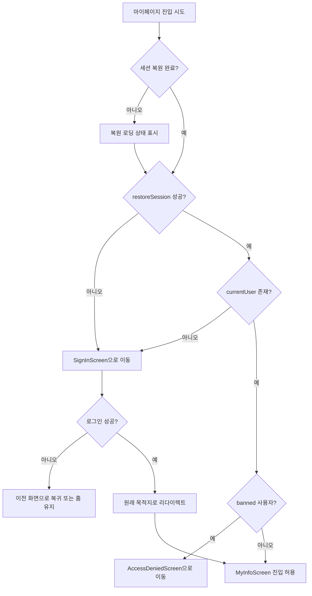

# ConCafe 구현 실행작업 백로그

기준 문서:
- [ConCafe_MVP_WBS_체크리스트.md](./ConCafe_MVP_WBS_%EC%B2%B4%ED%81%AC%EB%A6%AC%EC%8A%A4%ED%8A%B8.md)
- [UX plan.md](./UX%20plan.md)
- [# 🎀 ConCafe Firestore 컬렉션 다이어그램.md](./%23%20%F0%9F%8E%80%20ConCafe%20Firestore%20%EC%BB%AC%EB%A0%89%EC%85%98%20%EB%8B%A4%EC%9D%B4%EC%96%B4%EA%B7%B8%EB%9E%A8.md)
- [Maid_Cafe_Platform_Full_Project_Plan.md](./Maid_Cafe_Platform_Full_Project_Plan.md)

## 운영 규칙
- 우선순위: `P0(즉시)` / `P1(중요)` / `P2(후속)`
- 상태: `TODO` / `DOING` / `DONE`
- 각 작업은 완료 기준(AC: Acceptance Criteria)을 만족해야 DONE 처리

## A. 사전 확정 작업 (P0)

### A-01. 도메인 enum/스키마 최종 확정
- 우선순위: P0
- 상태: DONE
- 산출물: 스키마 결정표 문서 1부
- 작업:
  1. `conceptType` 허용값 최종 확정
  2. `events` 저장 위치(루트/서브컬렉션) 확정
  3. `favorites`, `visitHistory` 저장 전략 확정
- AC:
  - 클라이언트/백엔드가 동일한 필드 정의를 사용한다.
  - 모호한 필드가 0건이다.
- 결정사항:
  1. `conceptType`: `MAID | BUTLER | IDOL`
  2. `events` 저장 위치: `cafes/{cafeId}/events/{eventId}`
  3. `favorites`/`visitHistory`: `users/{userId}/favorites`, `users/{userId}/visits` 서브컬렉션
  4. 참고 문서 간 `events/{eventId}` 표기는 과거안으로 간주하고 서브컬렉션 기준으로 문서 통일
  5. 집계 필드는 `users.stats`, `cafes.stats`에 두고 클라이언트 직접 수정 금지

### A-08. 운영 승인/Claim 흐름 확정
- 우선순위: P0
- 상태: DONE
- 산출물: `cafeOwnerClaims`/`castClaims` 상태 전이표 + 승인 주체 규칙서
- 작업:
  1. 기존 카페 운영자 Claim 흐름 정의
  2. 기존 캐스트 Claim 흐름 정의
  3. 신규 카페 등록 후 Admin 승인 흐름 정의
  4. 승인 전/후 쓰기 가능 범위 차이 정의
- AC:
  - `PENDING/APPROVED/REJECTED` 상태 전이가 문서화된다.
  - `CAFE_OWNER`/`CAST` 권한 상승 조건이 명확하다.
  - 승인 전 데이터 오남용 경로가 없다.
- 결정사항:
  1. 기존 카페 운영자 신청은 `cafeOwnerClaims`로 저장하고 Admin이 승인 / 반려한다.
  2. 신규 카페 등록은 `cafeRegistrationClaims`로 저장하고 Admin 승인 시 실제 카페 문서와 owner 연결을 생성한다.
  3. 캐스트 프로필 연결은 `castClaims`로 저장하며 신청은 `팬관리`, 승인은 `카페 대시보드 > 캐스트 관리 섹션`에서 처리한다.
  4. 캐스트는 운영자용 카페 대시보드로 진입하지 않는다.
  5. claim 생성/승인/반려 후 관련 목록 화면은 explicit event 패턴으로 즉시 갱신한다.

### A-02. Firebase 보안 정책 초안 확정
- 우선순위: P0
- 상태: DONE
- 산출물: 역할별 권한 매트릭스
- 작업:
  1. `VISITOR`/`CAFE_OWNER`/`ADMIN`/`CAST` CRUD 범위 확정
  2. 리뷰 작성 선행조건(verified visit) 정책 확정
  3. 카페 승인 상태(`approved`) 노출 정책 확정
- AC:
  - 권한 정책 표에 예외 케이스가 명시된다.
  - 리뷰/체크인 관련 우회 경로가 없다.
- 결정사항:
  1. OWNER는 본인 카페 공지/리뷰 관리 가능
  2. ADMIN은 전체 리뷰/신고/밴 관리 가능

### A-03. 인증 UX 정책 확정 (기획 반영)
- 우선순위: P0
- 상태: DONE
- 산출물: 인증 상태/라우팅 상태도 1부
- 작업:
  1. 앱 첫 실행 기본 진입을 홈으로 고정
  2. 비로그인(게스트) 허용 범위와 로그인 필요 범위 확정
  3. 마이 페이지 비로그인 진입 시 로그인 라우팅 규칙 확정
  4. 로그인 세션 유지/복원 정책 확정
  5. 메인 네비게이션 3번째 탭 역할별 치환 규칙 확정
- AC:
  - 홈/탐색/상세는 게스트 접근 가능하다.
  - 마이 페이지는 로그인 없이는 접근 불가하다.
  - 로그인 후 앱 재실행 시 세션이 유지된다.
  - 게스트/`VISITOR`=`체크인`, `CAST`=`팬관리`, `CAFE_OWNER`=`카페관리`, `ADMIN`=`운영관리` 규칙이 문서화된다.
- 결정사항:
  1. 앱 첫 진입은 홈(게스트 허용)
  2. 마이 페이지는 로그인 필수
  3. 로그인 세션 유지(앱 재실행 자동 로그인)
  4. 메인 탭 3번째 위치는 역할별 교체 탭을 사용

### A-04. 로그인 필요 기능 매트릭스 확정
- 우선순위: P0
- 상태: DONE
- 산출물: 화면/액션별 로그인 요구표 1부
- 작업:
  1. 게스트 허용 기능과 로그인 필요 기능 분리
  2. 로그인 필요 기능 진입 시 공통 라우트 가드 적용 기준 확정
  3. 로그인 성공 후 복귀 대상(`pendingRoute`, `pendingAction`) 규칙 확정
- AC:
  - 즐겨찾기/팔로우/체크인/리뷰/좋아요/알림/마이페이지에 로그인 가드가 명시된다.
  - 비로그인 접근 시 동작이 모두 동일 정책(로그인 라우팅)으로 처리된다.
- 결정사항:
  1. 로그인 성공 시 `pendingRoute`/`pendingAction` 자동 재실행
  2. 취소 시 현재 화면 유지, 보호 액션 미실행
  3. 다중 역할 계정은 `ADMIN > CAFE_OWNER > CAST > VISITOR` 우선순위로 메인 탭 1개만 노출

### A-05. 운영 환경/시크릿 정책 확정
- 우선순위: P0
- 상태: DONE
- 산출물: 환경 설정 표 + 시크릿 관리 정책서
- 작업:
  1. Firebase `dev/staging/prod` 프로젝트 분리
  2. 플랫폼별 환경값 주입 방식 확정(Android/iOS/Desktop)
  3. 시크릿 저장 위치와 접근 권한 정책 확정
- AC:
  - 로컬/스테이징/운영 환경이 혼용되지 않는다.
  - 저장소에 민감정보가 커밋되지 않는다.
- 결정사항:
  1. Firebase 환경: `dev + prod` 2분리
  2. 시크릿은 저장소 커밋 금지, 환경별 주입 방식 사용

### A-06. 관측/로그 정책 확정
- 우선순위: P0
- 상태: DONE
- 산출물: 이벤트 택소노미 + 로그 정책서
- 작업:
  1. 핵심 이벤트 정의(로그인, 체크인 성공/실패, 리뷰 작성, 팔로우)
  2. Crash/오류 수집 정책 확정
  3. 사용자 식별자/개인정보 마스킹 규칙 확정
- AC:
  - MVP 핵심 퍼널 지표를 추적할 수 있다.
  - 민감정보 로그 노출이 없다.
- 결정사항:
  1. Crash 리포팅 활성화
  2. 최소 이벤트 고정: `sign_in_success`, `checkin_success`, `checkin_fail`, `review_create`, `favorite_toggle`, `follow_toggle`
  3. 개인정보(이메일/전화번호/정확좌표) 로그 저장 금지

### A-07. 배포/롤백/브랜치 전략 확정
- 우선순위: P0
- 상태: DONE
- 산출물: 배포 체크리스트 + 롤백 절차서
- 작업:
  1. develop -> main 머지 조건 정의
  2. 릴리즈 태그/노트 규칙 확정
  3. Cloud Functions/Firebase Rules 롤백 절차 확정
- AC:
  - 장애 시 이전 안정 버전으로 복구 가능하다.
  - 릴리즈 단위 추적이 가능하다.
- 결정사항:
  1. `develop -> main` 머지 후 릴리즈
  2. 태그/릴리즈 노트 필수

## B. 기반 구조 작업 (P0)

### B-01. shared 도메인 모델 정리
- 우선순위: P0
- 상태: TODO
- 산출물: 도메인 모델 목록/의존성 다이어그램
- 작업:
  1. User/Cafe/Cast/Visit/Review/Event 모델 정의
  2. Notice/Menu/Goods/CastSchedule/AppNotification/Stamp 모델 정의
  3. Favorite/Follow/Claim/Stats 조회 전용 모델 정의
  4. 도메인 에러/결과 타입 통일
  5. UseCase 단위 인터페이스 분리
- AC:
  - UI 모듈이 도메인 타입만 참조한다.
  - 기능별 UseCase 책임이 겹치지 않는다.
  - Firestore 컬렉션 다이어그램의 핵심 문서가 도메인 모델에서 누락되지 않는다.

### B-02. Repository 계약 정의
- 우선순위: P0
- 상태: TODO
- 산출물: Repository 인터페이스 명세서
- 작업:
  1. Auth/User/Cafe/Cast/Visit/Review/Notice 저장소 인터페이스 정의
  2. Event/Menu/Goods/Notification/Ranking 저장소 인터페이스 정의
  3. Favorite/Follow/Claim/Stamp 처리 책임 위치 확정
  4. 페이지네이션/정렬/필터 파라미터 규격화
  5. 실패 케이스 표준화(네트워크/권한/검증 실패)
- AC:
  - 화면 요구사항을 모두 커버하는 메서드가 존재한다.
  - 중복 메서드가 없다.
  - 홈/상세/마이/랭킹/알림에서 필요한 조회가 모두 계약에 포함된다.

### B-03. Firestore 인덱스/쿼리 계획
- 우선순위: P0
- 상태: TODO
- 산출물: 인덱스 목록 + 쿼리 대응표
- 작업:
  1. 탐색/랭킹/출근표/리뷰 조회 쿼리 확정
  2. 홈 섹션(인기/근처/생일/최신 공지) 조회 쿼리 확정
  3. 즐겨찾기/팔로우/방문기록/알림 조회 쿼리 확정
  4. 복합 인덱스 정의
  5. 예상 쿼리 비용 점검
- AC:
  - MVP 화면의 주요 쿼리가 인덱스 없이 실패하지 않는다.
  - `approved`, `stats.*`, `createdAt`, `birthday`, `date` 기준 정렬/필터가 재현 가능하다.

### B-05. 컬렉션 책임/집계 필드 정합성 문서화
- 우선순위: P0
- 상태: TODO
- 산출물: 컬렉션 책임표 1부
- 작업:
  1. 루트 컬렉션과 서브컬렉션 책임 구분(`visits`, `castSchedules`, `cafes/*`, `users/*`)
  2. `users.stats`, `cafes.stats` 집계 필드 읽기/쓰기 주체 정의
  3. `favoriteCount`, `reviewCount`, `visitCount`, `followerCount`, `popularityScore` 갱신 경로 정의
  4. 문서 간 상충 필드 표기 정리
- AC:
  - 동일 데이터의 소스 오브 트루스가 1곳으로 정리된다.
  - 클라이언트 직접 갱신 금지 필드가 명시된다.
  - 기획서/다이어그램/백로그 간 표기 충돌이 제거된다.

### B-04. 플랫폼별 네비게이션 구현 설계
- 우선순위: P0
- 상태: TODO
- 산출물: 플랫폼별 네비게이션 설계서 + 라우트 맵
- 작업:
  1. 공통 라우트 스펙 정의(`Home/Explore/CheckIn/Ranking/MyInfo/Cafe/Cast/SignIn/Notification/Settings`)
  2. 역할별 메인 탭 3번째 라우트 스펙 정의(`CheckIn | FanManagement | CafeManagement | AdminOperations`)
  3. 로그인 사용자 역할 변경 시 탭 재구성 규칙 정의
  4. 다중 역할 계정 우선순위(`ADMIN > CAFE_OWNER > CAST > VISITOR`) 적용 규칙 정의
  5. Android: Jetpack Navigation 그래프 설계 및 인증 가드 진입점 정의
  6. iOS: NavigationStack path 라우팅 설계 및 인증 가드 진입점 정의
  7. Desktop: 상태 기반 라우트 상태머신 설계 및 뒤로가기 정책 정의
  8. `pendingRoute/pendingAction` 규칙을 플랫폼별로 동일 적용
- AC:
  - 같은 사용자 시나리오에서 플랫폼별 화면 전환 결과가 동일하다.
  - 로그인 가드/복귀 동작이 플랫폼별로 동일하다.
  - 역할별 메인 탭 치환이 세 플랫폼에서 동일하게 동작한다.

## C. MVP 기능 작업 (P0-P1)

### C-01. 인증/프로필
- 우선순위: P0
- 상태: TODO
- 산출물: 게스트+로그인 전환 기반 프로필 플로우
- 작업:
  1. 앱 시작 시 홈 진입(비로그인 허용)
  2. 마이 페이지 진입 시 비로그인이면 로그인 화면으로 안내
  3. 로그인/로그아웃 처리 및 로그인 사용자 초기 유저 생성
  4. 프로필 조회/수정
  5. 차단 유저 접근 제한 처리
  6. 앱 재실행 시 세션 복원(자동 로그인)
- AC:
  - 로그인 없이 앱 첫 화면이 홈으로 열린다.
  - 비로그인 상태에서 마이 페이지 접근 시 로그인 화면으로 안내된다.
  - 로그인 후 앱 재실행해도 로그인 상태가 유지된다.
  - 프로필 수정 후 즉시 반영된다.

### C-01-1. 설정 스크린
- 우선순위: P1
- 상태: DONE
- 산출물: 마이 페이지에서 진입 가능한 `Settings` 스크린 1개
- 작업:
  1. `MyInfo -> Settings` 진입 라우트 추가
  2. 플랫폼별 `SettingsScreen`/`SettingsView` 기본 UI 구현
  3. 앱 버전, 계정 관리, 알림 설정 자리 표시 항목 배치
  4. `SignOut` 액션 진입점 연결
  5. 뒤로가기 시 `MyInfo`로 복귀 규칙 확인
- 메모:
  - 현재 범위에서는 설정 데이터 저장/동기화 기능을 만들지 않는다.
  - 이번 단계는 화면 추가와 네비게이션 연결만 수행한다.
- AC:
  - 마이 페이지에서 설정 화면으로 이동할 수 있다.
  - 설정 화면에서 뒤로 가면 마이 페이지로 복귀한다.
  - 설정 화면에 `SignOut` 진입점이 노출된다.

### C-02. 홈 탭
- 우선순위: P1
- 상태: TODO
- 산출물: 홈 화면(인기 메이드/근처 카페/생일/공지)
- 작업:
  1. 섹션별 데이터 소스 연결
  2. 로딩/에러/빈 상태 처리
  3. 카드 클릭 내비게이션 연결
  4. 데이터 부족 시 섹션 숨김/대체 카드 정책 반영
- AC:
  - 4개 섹션이 모두 렌더링된다.
  - 섹션별 에러가 화면 전체를 망가뜨리지 않는다.
  - 생일/공지 데이터가 없을 때도 홈 레이아웃이 깨지지 않는다.

### C-03. 탐색 탭
- 우선순위: P0
- 상태: TODO
- 산출물: 카페/메이드 탐색
- 작업:
  1. 검색바 + 지역 필터 + 정렬
  2. 내부 탭(카페/메이드) 전환
  3. 페이징/무한 스크롤 처리
- AC:
  - 필터 조합 변경 시 결과가 일관되게 갱신된다.
  - 스크롤 성능 저하 없이 목록이 확장된다.

### C-04. 카페 상세
- 우선순위: P0
- 상태: DONE
- 산출물: 카페 상세(정보/메이드/메뉴/리뷰/공지)
- 작업:
  1. 상단 이미지/기본 정보/즐겨찾기 구현
  2. `GetCafeDetailUseCase` 기반 상세 데이터 조합
  3. 메뉴/리뷰/공지 데이터 연결
  4. 비로그인 즐겨찾기 시 로그인 라우팅 연결
  5. 굿즈/이벤트는 현재 MVP 화면 노출 대상에서 제외
- AC:
  - 탭 전환 시 데이터가 정확히 표시된다.
  - 즐겨찾기 토글은 로그인 사용자만 즉시 반영된다.
  - 비로그인 즐겨찾기 시도 시 로그인 화면으로 라우팅된다.
  - 미구현 탭/데이터는 빈 상태 또는 숨김 정책 중 하나로 일관 처리된다.

### C-05. 메이드 상세
- 우선순위: P1
- 상태: TODO
- 산출물: 메이드 상세(프로필/소개/최근 활동/최근 후기/출근표 영역)
- 작업:
  1. 메이드 기본 정보/이미지 표시
  2. 소속 카페 이동 링크
  3. 팔로우 버튼/상태 연결(비로그인 시 로그인 라우팅)
  4. 최근 활동 카드(방문 인증/팔로워/개인 평점) 표시
  5. 최근 방문 후기 3개 표시
  6. 공식 SNS 링크(Instagram/X/TikTok 등) 노출
- AC:
  - 메이드 상세에서 카페 상세로 이동 가능하다.
  - 필수 정보 누락 시 대체 UI가 표시된다.
  - 비로그인 팔로우 시도 시 로그인 화면으로 라우팅된다.
  - 숨김 처리되지 않은 외부 링크만 노출된다.

### C-06. 체크인 + 방문 인증
- 우선순위: P0
- 상태: DOING
- 산출물: 체크인 플로우
- 작업:
  1. 카페 선택/날짜/메모 입력
  2. 위치 인증(100m) 검증 호출
  3. 방문 이력 저장 + 타임라인 반영
- 진행 반영:
  - Compose/iOS 체크인 시트에서 카페/날짜/시간/메모를 받아 `CreateVisitUseCase`를 통해 `shared` 계층에서 처리
  - `MockVisitRepository`/`MockConCafeDataSource` 기준으로 방문 데이터가 즉시 저장되고 타임라인에 반영됨
- AC:
  - 비로그인 체크인 시도 시 로그인 유도 UX가 노출된다.
  - 반경 밖 체크인은 실패 처리된다.
  - 성공 체크인은 즉시 방문 기록에 표시된다.
  - 체크인 탭은 게스트/`VISITOR`에서만 메인 탭 3번째 위치에 노출된다.

### C-06-1. 역할별 3번째 메인 탭 분기
- 우선순위: P0
- 상태: TODO
- 산출물: 역할별 메인 탭 노출/라우팅
- 작업:
  1. 현재 사용자 역할 조회 후 3번째 메인 탭 아이템 계산
  2. 게스트/`VISITOR`는 `체크인`, `CAST`는 `팬관리`, `CAFE_OWNER`는 `카페관리`, `ADMIN`은 `운영관리`로 매핑
  3. 로그인/로그아웃/세션 복원 시 탭 구성을 즉시 갱신
  4. 다중 역할 계정은 우선순위 규칙에 따라 단일 탭만 노출
- AC:
  - 동일 계정 상태에서 Android/iOS/Desktop 탭 구성이 일치한다.
  - 로그인 직후와 앱 재실행 직후 모두 올바른 탭이 보인다.
  - 로그아웃 시 3번째 탭은 항상 `체크인`으로 복귀한다.

### C-06-2. 팬관리 탭 엔트리
- 우선순위: P1
- 상태: DONE
- 산출물: `CAST` 전용 팬관리 진입 화면
- 작업:
  1. 내 프로필 요약/팔로워 수/출근 일정 바로가기 배치
  2. 팬 대상 공지/알림 관리 진입점 연결
  3. 비캐스트 접근 차단 또는 미노출 처리
- 메모:
  - 현재 단계는 Compose/iOS 공통 상태 구조와 동일 섹션 UI를 우선 구현한다.
  - 공지 작성/출근 관리/팬 메시지 상세 플로우는 다음 단계에서 실제 화면으로 연결한다.
- AC:
  - `CAST` 로그인 시 3번째 탭에서 팬관리 화면으로 진입된다.
  - 비캐스트는 해당 화면을 직접 열 수 없다.

### C-06-3. 카페관리 탭 엔트리
- 우선순위: P1
- 상태: DOING
- 산출물: `CAFE_OWNER` 전용 카페관리 진입 화면
- 작업:
  1. 운영 카페 0개일 때 Empty State 배치(`기존 카페 검색` / `새 카페 등록`)
  2. 운영 카페 1개 이상일 때 내 카페 목록 또는 선택 카페 대시보드 진입점 배치
  3. 기존 카페 검색 결과와 `이 카페 운영자 신청` 액션 연결
  4. 공지/이벤트/메뉴 관리 진입점 배치
  5. 캐스트/출근표 관리 진입점 연결
  6. 비운영자 접근 차단 또는 미노출 처리
- AC:
  - `CAFE_OWNER` 로그인 시 3번째 탭에서 카페관리 화면으로 진입된다.
  - 연결된 운영 카페가 없으면 Empty State가 노출된다.
  - 본인이 운영 권한을 가진 카페 기준 관리 진입점만 노출된다.
- 진행 메모:
  1. Android/iOS 카페관리 메인 화면 UI 구현 완료
  2. 다중 카페 목록 선택과 운영 대시보드 전환 UI 구현 완료
  3. Empty State와 `기존 카페 검색` / `새 카페 등록` CTA 배치 완료
  4. 카페관리 데이터 로딩은 `GetCafeManagementUseCase` + `CafeManagementRepository` 경로로 연결 완료
  5. `CafeManagementRepository`는 `ConCafeDataSource` 원천 데이터만 읽어 조합하도록 정리 완료
  6. 기존 카페 검색 결과/운영자 Claim 실제 서버 연결은 후속 단계에서 구현

### C-06-3-1. 카페 정보 수정 화면
- 우선순위: P1
- 상태: DONE
- 산출물: `CAFE_OWNER` 전용 카페 정보 수정 화면 + 저장 반영 흐름
- 작업:
  1. 카페 대시보드에서 `카페 정보 관리` 진입 라우트 연결
  2. `CafeInfoEdit` 화면 UI 구현(Android/iOS)
  3. 초기값을 `GetCafeDetailUseCase`로 로드
  4. 저장 시 `UpdateCafeInfoUseCase` -> `CafeRepository.updateCafeInfo()` 경로 연결
  5. `ConCafeDataSource` 원천 데이터 갱신 후 카페 상세/운영 화면에 즉시 반영
  6. 저장 성공 피드백을 Compose 스낵바 / iOS alert로 분리
- AC:
  - 카페 운영자는 대시보드에서 카페 정보 수정 화면으로 진입할 수 있다.
  - 초기값은 실제 카페 상세 데이터와 동일하다.
  - 저장 후 같은 카페의 상세/운영 화면에서 수정값이 즉시 보인다.
  - 화면 내부 하드코딩 초기값은 사용하지 않는다.

### C-06-3-2. 카페 메뉴&굿즈 관리 화면
- 우선순위: P1
- 상태: DONE
- 산출물: `CAFE_OWNER` 전용 메뉴&굿즈 관리 화면(Android/iOS)
- 작업:
  1. 카페 대시보드에서 `메뉴&굿즈` 진입 라우트 연결
  2. Compose `MenuGoodsScreen` / iOS `MenuGoodsView` UI 구현
  3. `GetCafeDetailUseCase`로 메뉴/굿즈 목록 로드
  4. 메뉴/굿즈 탭 전환, 카테고리 필터, 검색 UI 연결
  5. 메뉴/굿즈 추가 및 수정 화면 연결
  6. 메뉴 판매 상태를 `CafeMenu.isAvailable` 공용 모델 필드에 반영
  7. 메뉴/굿즈 삭제 확인 UX 및 실제 삭제 로직 연결
- 메모:
  - 현재 단계는 조회 + 추가/수정/삭제까지 mock shared 데이터 기준으로 구현한다.
  - 메뉴 품절/판매중은 `CafeMenu.isAvailable`, 굿즈 품절/판매중은 `Goods.stock`으로 관리한다.
  - 삭제는 목록에서 즉시 실행하지 않고 확인 다이얼로그/알럿에서 사용자 확인 후 수행한다.
  - 목록 갱신은 화면 재진입 refresh가 아니라 shared `observeCafeDetail` 스트림으로 동기화한다.
  - 실제 서버 동기화와 이미지 업로드는 후속 단계에서 구현한다.
- AC:
  - 카페 운영자는 대시보드에서 메뉴&굿즈 관리 화면으로 이동할 수 있다.
  - Android/iOS가 동일한 섹션 구조와 액션 흐름으로 동작한다.
  - 목록 데이터는 화면 하드코딩이 아니라 `GetCafeDetailUseCase` 결과를 사용한다.
  - 메뉴/굿즈 추가/수정/삭제 결과가 KMP shared mock 데이터에 반영된다.
  - 메뉴 판매 상태는 `CafeMenu.isAvailable` 기준으로 표시된다.
  - 삭제 아이콘 클릭 시 양 플랫폼 모두 확인 UX가 먼저 노출된다.

### C-06-3-3. 캐스트 프로필 추가/수정 화면
- 우선순위: P1
- 상태: DONE
- 산출물: 캐스트/카페운영자 공용 `캐스트 프로필 추가/수정` 화면(Android/iOS)
- 작업:
  1. 카페 대시보드 캐스트 `+` 진입점에서 `CastEdit` 라우트 연결
  2. Compose `CastEditScreen` / iOS `CastEditView` UI 구현
  3. 수정 모드 초기값을 `GetCastDetailUseCase`로 로드
  4. 저장 시 `UpsertCastUseCase` -> `CastRepository.upsertCast()` 경로 연결
  5. `MockConCafeDataSource` 원천 데이터에서 캐스트 기본 정보와 출근 스케줄을 함께 갱신
- 메모:
  - 현재 단계는 캐스트 이름, 컨셉 역할, 생일, 소개, 근무 요일까지 mock shared 데이터 기준으로 구현한다.
  - 추가 모드는 현재 로그인한 운영자의 첫 소유 카페 기준으로 캐스트를 생성한다.
  - 수정 모드는 기존 `castId`를 유지하고 같은 캐스트의 상세 데이터를 다시 로드할 수 있어야 한다.
  - 프로필 사진/갤러리 업로드, 외부 SNS 링크 CRUD는 후속 단계에서 구현한다.
- AC:
  - 카페 운영자는 대시보드에서 `캐스트 프로필 추가` 화면으로 진입할 수 있다.
  - 수정 화면 초기값은 실제 캐스트 상세 데이터와 동일하다.
  - Android/iOS가 동일한 입력 검증과 저장 흐름으로 동작한다.
  - 캐스트 추가/수정 결과가 KMP shared mock 데이터에 반영된다.
  - 근무 요일 선택 결과는 `castSchedules` 기준으로 다시 로드된다.

### C-06-4. 운영관리 탭 엔트리
- 우선순위: P1
- 상태: TODO
- 산출물: `ADMIN` 전용 운영관리 진입 화면
- 작업:
  1. 카페 승인/Claim 승인/신고·밴 관리 진입점 배치
  2. 전체 운영 현황 요약 카드 배치
  3. 비관리자 접근 차단 또는 미노출 처리
- AC:
  - `ADMIN` 로그인 시 3번째 탭에서 운영관리 화면으로 진입된다.
  - 관리자 전용 기능은 비관리자에게 노출되지 않는다.

### C-07. 리뷰
- 우선순위: P0
- 상태: TODO
- 산출물: 리뷰 작성/조회
- 작업:
  1. 방문 인증 사용자만 작성 허용
  2. 별점/내용/이미지 업로드
  3. 같은 카페 소속 캐스트 선택 태그(`taggedCastIds`) 지원
  4. 캐스트 상세에서는 `함께 언급된 후기`로 태그된 카페 리뷰만 노출
  5. 리뷰 좋아요/삭제 로그인 가드 적용
- AC:
  - 비로그인 리뷰 작성/좋아요/삭제 시도 시 로그인 화면으로 라우팅된다.
  - 미인증 사용자는 작성 버튼이 차단된다.
  - 작성 후 평균 평점/리뷰 수가 갱신된다.
  - 캐스트 상세 후기 섹션에는 캐스트 전용 리뷰가 아니라 `taggedCastIds` 기준 카페 리뷰만 표시된다.
  - 체크인 완료 직후에는 리뷰 작성 유도 바텀시트를 1회 노출한다.

### C-08. 마이 페이지
- 우선순위: P1
- 상태: TODO
- 산출물: 마이 페이지 기본
- 작업:
  1. 프로필/레벨/총 방문수
  2. 방문 기록 목록
  3. 즐겨찾기 카페 목록
  4. 추후 스탬프/배지/팔로우 섹션 확장을 고려한 상태 구조 설계
- AC:
  - 비로그인 접근 시 로그인 화면으로 라우팅된다.
  - 로그인 성공 후 원래 요청한 마이 페이지로 복귀한다.
  - 사용자 기준 개인 데이터만 노출된다.

### C-10. 랭킹 읽기 전용 MVP
- 우선순위: P1
- 상태: TODO
- 산출물: 메이드/카페 랭킹 조회 화면
- 작업:
  1. 주간/월간 랭킹 조회 규격 정의
  2. 지역 필터(KR/JP/도시) 연결
  3. 점수식 미확정 시 임시 정렬 기준(`followerCount`, `popularityScore`) 적용
- AC:
  - 사용자는 랭킹 탭에서 카페/메이드 순위를 조회할 수 있다.
  - 점수식 확정 전에도 정렬 기준이 문서화되어 있다.

### C-11. 팔로우/즐겨찾기 보조 데이터 반영
- 우선순위: P1
- 상태: TODO
- 산출물: 팔로우/즐겨찾기 상태 동기화
- 작업:
  1. `users/{userId}/favorites`와 `cafeFavorites/{cafeId}/users` 양방향 전략 결정
  2. `castFollowers/{castId}/users` 읽기/쓰기 경로 확정
  3. 상세/마이/랭킹에서 동일 상태가 보이도록 캐시/집계 동기화
- AC:
  - 즐겨찾기/팔로우 상태가 화면별로 불일치하지 않는다.
  - 카운트와 사용자 상태 조회 경로가 분리되어도 동작이 일관된다.

### C-09. 알림
- 우선순위: P1
- 상태: DOING
- 산출물: 알림 목록/읽음 처리
- 작업:
  1. 알림 목록 조회
  2. 읽음 처리
  3. 비로그인 접근 라우트 가드 적용
  4. 알림 유형별 섹션 그룹(`출근/생일/카페 공지/팔로우`) 공통 UseCase로 구성
- AC:
  - 비로그인 알림 진입 시 로그인 화면으로 라우팅된다.
  - 로그인 사용자는 알림 조회/읽음 처리가 가능하다.

## D. 서버 검증/집계 작업 (P0)

### D-01. 리뷰 검증 함수
- 우선순위: P0
- 상태: TODO
- 산출물: 리뷰 검증 로직 명세 및 적용
- 작업:
  1. 리뷰 생성 시 `verified visit` 확인
  2. 실패 코드 표준화
- AC:
  - 조건 미충족 리뷰 생성이 100% 차단된다.

### D-02. 체크인 위치 검증 함수
- 우선순위: P0
- 상태: TODO
- 산출물: 체크인 검증 로직 명세 및 적용
- 작업:
  1. 카페 좌표-사용자 좌표 거리 계산
  2. 허용 반경(100m) 비교
- AC:
  - 거리 경계값 테스트가 통과한다.

### D-03. 집계 업데이트 함수
- 우선순위: P0
- 상태: TODO
- 산출물: 평점/리뷰수/팔로워수 집계 전략
- 작업:
  1. 리뷰 작성/삭제 시 평점, 카운트 갱신
  2. 팔로우/언팔로우 시 followerCount 갱신
  3. 즐겨찾기/방문/스탬프 집계 필드 갱신 규칙 정의
- AC:
  - 집계 값이 원본 데이터와 불일치하지 않는다.

### D-04. 승인/Claim 검증 함수
- 우선순위: P0
- 상태: TODO
- 산출물: Claim 승인 검증 로직 명세 및 적용
- 작업:
  1. `cafeOwnerClaims`, `castClaims` 생성 시 중복 요청 차단
  2. 승인 시 역할/연결 필드(`ownedCafeIds`, `ownerIds`, `linkedUserId`) 반영 규칙 정의
  3. 반려/취소 후 재신청 가능 정책 정의
- AC:
  - 동일 사용자 중복 claim이 비정상적으로 누적되지 않는다.
  - 승인 후 권한 반영이 원자적으로 처리된다.

### D-05. 스탬프 적립/중복 방지 함수
- 우선순위: P1
- 상태: TODO
- 산출물: 스탬프 지급 규칙 명세 및 적용
- 작업:
  1. `visitId` 기준 1회 적립 보장
  2. 적립 시 `users.stats.stampCount` 반영
  3. 추후 배지/레벨 시스템 확장을 위한 이벤트 포맷 정의
- AC:
  - 동일 방문으로 스탬프가 중복 적립되지 않는다.
  - 방문 성공과 스탬프 적립 결과를 추적할 수 있다.

## E. 테스트/릴리즈 작업 (P2, MVP 구현 후)

### E-01. 도메인 테스트
- 우선순위: P2
- 상태: TODO
- 산출물: UseCase 단위 테스트 세트
- 작업:
  1. 체크인/리뷰/권한 시나리오 테스트
  2. 예외/실패 경로 테스트
- AC:
  - 핵심 유스케이스 정상/예외 경로가 모두 검증된다.

### E-02. 권한 시나리오 테스트
- 우선순위: P2
- 상태: TODO
- 산출물: `VISITOR`/`CAFE_OWNER`/`ADMIN`/`CAST` 규칙 검증 리포트
- 작업:
  1. 허용 요청/차단 요청 케이스 작성
  2. 룰 회귀 테스트
- AC:
  - 권한 누수 케이스가 0건이다.

### E-03. 스모크 테스트
- 우선순위: P2
- 상태: TODO
- 산출물: MVP 사용자 시나리오 체크 결과
- 작업:
  1. 홈→탐색→상세→체크인→리뷰 end-to-end 점검
  2. 오류 메시지/복구 동작 점검
- AC:
  - 핵심 플로우가 끊김 없이 완료된다.

### E-04. 보안 규칙 자동 테스트
- 우선순위: P2
- 상태: TODO
- 산출물: Firestore/Storage Rules 테스트 스위트
- 작업:
  1. `VISITOR`/`CAFE_OWNER`/`ADMIN`/`CAST` 허용/차단 케이스 자동화
  2. 리뷰 작성(verified visit 필요) 제약 테스트
- AC:
  - 배포 전 권한 회귀가 자동으로 검출된다.

### E-05. 딥링크/푸시 가드 테스트
- 우선순위: P2
- 상태: TODO
- 산출물: 보호 라우트 진입 테스트 리포트
- 작업:
  1. 비로그인 상태 딥링크 진입 시 로그인 유도 확인
  2. 로그인 성공 후 pendingRoute/pendingAction 복귀 확인
- AC:
  - 모든 보호 라우트에서 동일한 가드 동작을 보장한다.

## F. 즉시 착수 순서(제가 먼저 진행할 순서)
1. A-01, A-02, A-03, A-04, A-05, A-06, A-07
2. B-01, B-02, B-03
3. C-01, C-03, C-04
4. C-06, C-07
5. D-01, D-02, D-03
6. C-02, C-05, C-08, C-09
7. (MVP 완료 후) E-01, E-02, E-03, E-04, E-05

## G. 진행 로그 템플릿
- 날짜:
- 작업 ID:
- 상태 변경: TODO -> DOING -> DONE
- 변경 요약:
- 이슈/리스크:
- 다음 작업:

## H. 설계 상세 (모듈/레이어)

### H-01. 모듈 책임
- `shared`: 도메인 모델, 유스케이스, Repository 인터페이스, 검증 규칙
- `composeApp`: 화면, MVI Presenter(ViewModel), 내비게이션, UI 상태 처리
- `iosApp`: iOS 엔트리/브리징(SwiftUI)

### H-03. 플랫폼 네비게이션 전략(확정)
- Android:
  - `NavHost` + `NavController` 기반
  - 하단 탭은 nested graph로 구성
  - 3번째 탭 destination은 역할에 따라 `CheckIn`/`FanManagement`/`CafeManagement`/`AdminOperations`로 교체
  - 상세/로그인/알림은 route push로 이동
  - 인증 가드는 진입 직전 `navigate(SignIn)` + `savedStateHandle`에 pending 정보 저장
- iOS:
  - `NavigationStack` + `NavigationPath` 기반
  - 탭 루트는 `TabView`, 상세는 `NavigationDestination` push
  - 3번째 탭 item은 세션 역할에 따라 동적으로 교체
  - 로그인은 전용 화면 route push
  - 인증 가드는 `pendingRoute` 저장 후 로그인 성공 시 path 복원
- Desktop:
  - `currentRoute: MutableState<Route>` 기반 상태 전환
  - 메인 탭 구성은 `AuthRepository.observeCurrentUser()` 기반 세션 역할 상태를 구독해 3번째 탭을 동적으로 교체
  - 상세 진입 시 `routeStack`에 push, 뒤로가기 시 pop
  - 인증 가드는 route 전환 전 intercept 후 SignIn route로 변경
  - 창 닫기 이벤트와 분리된 앱 내부 back action 제공

### H-02. 패키지 설계(계획)
- `shared/src/commonMain/kotlin/org/hhp227/concafe/domain/model`
- `shared/src/commonMain/kotlin/org/hhp227/concafe/domain/repository`
- `shared/src/commonMain/kotlin/org/hhp227/concafe/domain/usecase`
- `shared/src/commonMain/kotlin/org/hhp227/concafe/domain/validation`
- `shared/src/commonMain/kotlin/org/hhp227/concafe/domain/common`
- `shared/src/commonMain/kotlin/org/hhp227/concafe/data/repository`
- `shared/src/commonMain/kotlin/org/hhp227/concafe/data/mapper`
- `composeApp/src/commonMain/kotlin/org/hhp227/concafe/presentation/navigation`
- `composeApp/src/commonMain/kotlin/org/hhp227/concafe/presentation/screen/main/home`
- `composeApp/src/commonMain/kotlin/org/hhp227/concafe/presentation/screen/main/explore`
- `composeApp/src/commonMain/kotlin/org/hhp227/concafe/presentation/screen/main/checkin`
- `composeApp/src/commonMain/kotlin/org/hhp227/concafe/presentation/screen/main/ranking`
- `composeApp/src/commonMain/kotlin/org/hhp227/concafe/presentation/screen/main/myinfo`
- `composeApp/src/commonMain/kotlin/org/hhp227/concafe/presentation/screen/cafe`
- `composeApp/src/commonMain/kotlin/org/hhp227/concafe/presentation/screen/cast`
- `composeApp/src/commonMain/kotlin/org/hhp227/concafe/presentation/screen/notification`
- `composeApp/src/commonMain/kotlin/org/hhp227/concafe/presentation/common`

## I. 생성 예정 파일/클래스 목록

### I-01. Domain Model (`shared`)
- 파일: `shared/src/commonMain/kotlin/org/hhp227/concafe/domain/model/User.kt`
  - 클래스: `User`, `UserRole`
- 파일: `shared/src/commonMain/kotlin/org/hhp227/concafe/domain/model/Cafe.kt`
  - 클래스: `Cafe`
  - 필드 메모: 소개 문구는 `description`이 아닌 `desc` 사용
- 파일: `shared/src/commonMain/kotlin/org/hhp227/concafe/domain/model/Cast.kt`
  - 클래스: `Cast`
  - 필드 메모: 소개 문구는 `description`이 아닌 `desc` 사용
- 파일: `shared/src/commonMain/kotlin/org/hhp227/concafe/domain/model/CastSchedule.kt`
  - 클래스: `CastSchedule`
- 파일: `shared/src/commonMain/kotlin/org/hhp227/concafe/domain/model/CafeMenu.kt`
  - 클래스: `CafeMenu`
  - 필드 메모: 메뉴 설명은 `description`이 아닌 `desc` 사용
- 파일: `shared/src/commonMain/kotlin/org/hhp227/concafe/domain/model/Goods.kt`
  - 클래스: `Goods`
- 파일: `shared/src/commonMain/kotlin/org/hhp227/concafe/domain/model/Review.kt`
  - 클래스: `Review`
- 파일: `shared/src/commonMain/kotlin/org/hhp227/concafe/domain/model/Visit.kt`
  - 클래스: `Visit`
- 파일: `shared/src/commonMain/kotlin/org/hhp227/concafe/domain/model/Notice.kt`
  - 클래스: `Notice`
- 파일: `shared/src/commonMain/kotlin/org/hhp227/concafe/domain/model/Event.kt`
  - 클래스: `Event`, `EventType`

### I-02. Domain Common (`shared`)
- 파일: `shared/src/commonMain/kotlin/org/hhp227/concafe/domain/common/AppError.kt`
  - 클래스: `AppError`(sealed class)
- 파일: `shared/src/commonMain/kotlin/org/hhp227/concafe/domain/common/AppResult.kt`
  - 클래스: `AppResult`(sealed class)
- 파일: `shared/src/commonMain/kotlin/org/hhp227/concafe/domain/common/PagedResult.kt`
  - 클래스: `PagedResult<T>`

### I-03. Repository Interfaces (`shared`)
- 파일: `shared/src/commonMain/kotlin/org/hhp227/concafe/domain/repository/AuthRepository.kt`
  - 인터페이스: `AuthRepository`
- 파일: `shared/src/commonMain/kotlin/org/hhp227/concafe/domain/repository/UserRepository.kt`
  - 인터페이스: `UserRepository`
- 파일: `shared/src/commonMain/kotlin/org/hhp227/concafe/domain/repository/CafeRepository.kt`
  - 인터페이스: `CafeRepository`
- 파일: `shared/src/commonMain/kotlin/org/hhp227/concafe/domain/repository/CastRepository.kt`
  - 인터페이스: `CastRepository`
- 파일: `shared/src/commonMain/kotlin/org/hhp227/concafe/domain/repository/VisitRepository.kt`
  - 인터페이스: `VisitRepository`
- 파일: `shared/src/commonMain/kotlin/org/hhp227/concafe/domain/repository/ReviewRepository.kt`
  - 인터페이스: `ReviewRepository`
- 파일: `shared/src/commonMain/kotlin/org/hhp227/concafe/domain/repository/NoticeRepository.kt`
  - 인터페이스: `NoticeRepository`
- 파일: `shared/src/commonMain/kotlin/org/hhp227/concafe/domain/repository/RankingRepository.kt`
  - 인터페이스: `RankingRepository`
- 파일: `shared/src/commonMain/kotlin/org/hhp227/concafe/domain/repository/NotificationRepository.kt`
  - 인터페이스: `NotificationRepository`

### I-04. UseCases (`shared`)
- 파일: `shared/src/commonMain/kotlin/org/hhp227/concafe/domain/usecase/GetHomeFeedUseCase.kt`
  - 클래스: `GetHomeFeedUseCase`
- 파일: `shared/src/commonMain/kotlin/org/hhp227/concafe/domain/usecase/GetExploreFeedUseCase.kt`
  - 클래스: `GetExploreFeedUseCase`
- 파일: `shared/src/commonMain/kotlin/org/hhp227/concafe/domain/usecase/GetCafeDetailUseCase.kt`
  - 클래스: `GetCafeDetailUseCase`
- 파일: `shared/src/commonMain/kotlin/org/hhp227/concafe/domain/usecase/GetMainNavigationUseCase.kt`
  - 클래스: `GetMainNavigationUseCase`
- 파일: `shared/src/commonMain/kotlin/org/hhp227/concafe/domain/usecase/GetMyInfoUseCase.kt`
  - 클래스: `GetMyInfoUseCase`
- 파일: `shared/src/commonMain/kotlin/org/hhp227/concafe/domain/usecase/GetRankingFeedUseCase.kt`
  - 클래스: `GetRankingFeedUseCase`
- 파일: `shared/src/commonMain/kotlin/org/hhp227/concafe/domain/usecase/ToggleFavoriteCafeUseCase.kt`
  - 클래스: `ToggleFavoriteCafeUseCase`
- 파일: `shared/src/commonMain/kotlin/org/hhp227/concafe/domain/usecase/ObserveCurrentUserUseCase.kt`
  - 클래스: `ObserveCurrentUserUseCase`
- 파일: `shared/src/commonMain/kotlin/org/hhp227/concafe/domain/usecase/SignInUseCase.kt`
  - 클래스: `SignInUseCase`
- 파일: `shared/src/commonMain/kotlin/org/hhp227/concafe/domain/usecase/SignOutUseCase.kt`
  - 클래스: `SignOutUseCase`

### I-05. Validation Rules (`shared`)
- 파일: `shared/src/commonMain/kotlin/org/hhp227/concafe/domain/validation/VisitVerificationPolicy.kt`
  - 클래스: `VisitVerificationPolicy`
- 파일: `shared/src/commonMain/kotlin/org/hhp227/concafe/domain/validation/ReviewPolicy.kt`
  - 클래스: `ReviewPolicy`
- 파일: `shared/src/commonMain/kotlin/org/hhp227/concafe/domain/validation/RolePermissionPolicy.kt`
  - 클래스: `RolePermissionPolicy`

### I-06. Data Layer Skeleton (`shared`)
- 파일: `shared/src/commonMain/kotlin/org/hhp227/concafe/data/repository/FakeAuthRepository.kt`
  - 클래스: `FakeAuthRepository`
  - 현재 구현: `signUp(email, password, nickname, role)` 호출 시 `MockConCafeDataSource.users`에 인메모리 `User`를 추가하고 `currentUserId`를 갱신한다.
- 파일: `shared/src/commonMain/kotlin/org/hhp227/concafe/data/repository/FakeCafeRepository.kt`
  - 클래스: `FakeCafeRepository`
- 파일: `shared/src/commonMain/kotlin/org/hhp227/concafe/data/repository/FakeCastRepository.kt`
  - 클래스: `FakeCastRepository`
- 파일: `shared/src/commonMain/kotlin/org/hhp227/concafe/data/repository/FakeVisitRepository.kt`
  - 클래스: `FakeVisitRepository`
- 파일: `shared/src/commonMain/kotlin/org/hhp227/concafe/data/repository/FakeReviewRepository.kt`
  - 클래스: `FakeReviewRepository`

### I-07. Presentation Navigation/UI (`composeApp`)
- 파일: `composeApp/src/commonMain/kotlin/org/hhp227/concafe/presentation/navigation/ConCafeRoute.kt`
  - 클래스: `ConCafeRoute`(sealed class)
- 파일: `composeApp/src/commonMain/kotlin/org/hhp227/concafe/presentation/navigation/ConCafeNavGraph.kt`
  - 함수/클래스: `ConCafeNavGraph`
- 파일: `composeApp/src/commonMain/kotlin/org/hhp227/concafe/presentation/navigation/BottomTabItem.kt`
  - 클래스: `BottomTabItem`
- 파일: `composeApp/src/androidMain/kotlin/org/hhp227/concafe/presentation/navigation/AndroidNavHost.kt`
  - 함수: `AndroidNavHost`
- 파일: `iosApp/iosApp/navigation/AppRouter.swift`
  - 클래스: `AppRouter`
- 파일: `iosApp/iosApp/navigation/Route.swift`
  - enum: `Route`
- 파일: `composeApp/src/jvmMain/kotlin/org/hhp227/concafe/presentation/navigation/DesktopRouteState.kt`
  - 클래스: `DesktopRouteState`

### I-08. Presentation MVI (`composeApp`)
- 파일: `composeApp/src/commonMain/kotlin/org/hhp227/concafe/presentation/screen/main/home/HomeViewModel.kt`
  - 클래스: `HomeViewModel`, `HomeUiState`, `HomeEvent`, `HomeAction`
- 파일: `composeApp/src/commonMain/kotlin/org/hhp227/concafe/presentation/screen/main/explore/ExploreViewModel.kt`
  - 클래스: `ExploreViewModel`, `ExploreUiState`, `ExploreEvent`, `ExploreAction`, `ExploreFilterState`
- 파일: `composeApp/src/commonMain/kotlin/org/hhp227/concafe/presentation/screen/main/checkin/CheckInViewModel.kt`
  - 클래스: `CheckInViewModel`, `CheckInUiState`, `CheckInEvent`, `CheckInAction`
- 파일: `composeApp/src/commonMain/kotlin/org/hhp227/concafe/presentation/screen/cafe/CafeViewModel.kt`
  - 클래스: `CafeViewModel`, `CafeUiState`, `CafeEvent`, `CafeAction`
- 파일: `composeApp/src/commonMain/kotlin/org/hhp227/concafe/presentation/screen/cast/CastViewModel.kt`
  - 클래스: `CastViewModel`, `CastUiState`, `CastEvent`, `CastAction`
- 파일: `composeApp/src/commonMain/kotlin/org/hhp227/concafe/presentation/screen/main/ranking/RankingViewModel.kt`
  - 클래스: `RankingViewModel`, `RankingUiState`, `RankingEvent`, `RankingAction`
- 파일: `composeApp/src/commonMain/kotlin/org/hhp227/concafe/presentation/screen/main/myinfo/MyInfoViewModel.kt`
  - 클래스: `MyInfoViewModel`, `MyInfoUiState`, `MyInfoEvent`, `MyInfoAction`

### I-09. Presentation Screens (`composeApp`)
- 파일: `composeApp/src/commonMain/kotlin/org/hhp227/concafe/presentation/screen/main/home/HomeScreen.kt`
  - 컴포저블: `HomeScreen`
- 파일: `composeApp/src/commonMain/kotlin/org/hhp227/concafe/presentation/screen/main/explore/ExploreScreen.kt`
  - 컴포저블: `ExploreScreen`
- 파일: `composeApp/src/commonMain/kotlin/org/hhp227/concafe/presentation/screen/main/checkin/CheckInScreen.kt`
  - 컴포저블: `CheckInScreen`
- 파일: `composeApp/src/commonMain/kotlin/org/hhp227/concafe/presentation/screen/cafe/CafeScreen.kt`
  - 컴포저블: `CafeScreen`
- 파일: `composeApp/src/commonMain/kotlin/org/hhp227/concafe/presentation/screen/cast/CastScreen.kt`
  - 컴포저블: `CastScreen`
- 파일: `composeApp/src/commonMain/kotlin/org/hhp227/concafe/presentation/screen/main/ranking/RankingScreen.kt`
  - 컴포저블: `RankingScreen`
- 파일: `composeApp/src/commonMain/kotlin/org/hhp227/concafe/presentation/screen/main/myinfo/MyInfoScreen.kt`
  - 컴포저블: `MyInfoScreen`
- 파일: `composeApp/src/commonMain/kotlin/org/hhp227/concafe/presentation/screen/notification/NotificationScreen.kt`
  - 컴포저블: `NotificationScreen`

### I-10. 공통 UI/리소스 (`composeApp`)
- 파일: `composeApp/src/commonMain/kotlin/org/hhp227/concafe/presentation/common/UiState.kt`
  - 클래스: `UiState<T>`
- 파일: `composeApp/src/commonMain/kotlin/org/hhp227/concafe/presentation/common/ConCafeTopBar.kt`
  - 컴포저블: `ConCafeTopBar`
- 파일: `composeApp/src/commonMain/kotlin/org/hhp227/concafe/presentation/common/ConCafeCard.kt`
  - 컴포저블: `ConCafeCard`
- 파일: `composeApp/src/commonMain/kotlin/org/hhp227/concafe/presentation/common/EmptyStateView.kt`
  - 컴포저블: `EmptyStateView`
- 파일: `composeApp/src/commonMain/kotlin/org/hhp227/concafe/presentation/common/ErrorStateView.kt`
  - 컴포저블: `ErrorStateView`

## J. 단계별 파일 생성 순서
1. `I-01`, `I-02` Domain 모델/공통 타입
2. `I-03`, `I-04`, `I-05` Repository/UseCase/정책
3. `I-06` Data 레이어 임시(Fake) 구현
4. `B-04` 플랫폼별 네비게이션 뼈대 구현(Android/iOS/Desktop)
5. `I-07`, `I-08`, `I-09`, `I-10` Presentation 구현
6. Cloud Functions/Rules 문서 반영 후 실제 Firebase 구현으로 전환

## K. 필수 메서드 시그니처 (초안)

### K-01. 공통 타입
```kotlin
sealed interface AppResult<out T> {
    data class Success<T>(val data: T) : AppResult<T>
    data class Failure(val error: AppError) : AppResult<Nothing>
}

sealed interface AppError {
    data object Unauthorized : AppError
    data object PermissionDenied : AppError
    data object NotFound : AppError
    data class ValidationFailed(val reason: String) : AppError
    data class NetworkError(val message: String? = null) : AppError
    data class Unknown(val cause: String? = null) : AppError
}

data class PagedResult<T>(
    val items: List<T>,
    val nextCursor: String? = null,
    val hasNext: Boolean = false
)
```

### K-02. Repository 시그니처 (`shared/domain/repository`)
```kotlin
interface AuthRepository {
    suspend fun signIn(email: String, password: String): User
    suspend fun signUp(email: String, password: String, nickname: String, role: UserRole): User
    suspend fun signOut()
    suspend fun restoreSession(): User?
    suspend fun getCurrentUser(): User?
    fun observeCurrentUser(): Flow<User?>
}

interface UserRepository {
    suspend fun getUser(userId: String): User
    suspend fun updateProfile(userId: String, nickname: String, profileImage: String?)
    suspend fun getMyPageSummary(userId: String): MyPageSummary
}

interface CafeRepository {
    suspend fun searchCafes(
        query: String?,
        country: String?,
        city: String?,
        sort: CafeSort,
        cursor: String?,
        pageSize: Int
    ): PagedResult<Cafe>
    suspend fun getCafeDetail(cafeId: String): CafeDetail
    suspend fun isFavorite(userId: String, cafeId: String): Boolean
    suspend fun toggleFavorite(userId: String, cafeId: String): Boolean
}

interface CastRepository {
    suspend fun searchCasts(
        query: String?,
        country: String?,
        city: String?,
        sort: CastSort,
        cursor: String?,
        pageSize: Int
    ): PagedResult<Cast>
    suspend fun getCastDetail(castId: String): CastDetail
    suspend fun getCastSchedules(castId: String, fromDate: String, toDate: String): List<CastSchedule>
    suspend fun followCast(userId: String, castId: String)
    suspend fun unfollowCast(userId: String, castId: String)
}

interface VisitRepository {
    suspend fun verifyVisit(cafeId: String, latitude: Double, longitude: Double, visitedAt: String): VisitVerificationResult
    suspend fun createVisit(userId: String, cafeId: String, visitedAt: String, memo: String?): Visit
    suspend fun getVisits(userId: String, cursor: String?, pageSize: Int): PagedResult<Visit>
}

interface ReviewRepository {
    suspend fun getCafeReviews(cafeId: String, cursor: String?, pageSize: Int): PagedResult<Review>
    suspend fun createReview(
        userId: String,
        cafeId: String,
        rating: Float,
        content: String,
        imageUrls: List<String>
    ): Review
    suspend fun deleteReview(reviewId: String, requesterId: String)
}

interface NoticeRepository {
    suspend fun getCafeNotices(cafeId: String, limit: Int): List<Notice>
}

interface RankingRepository {
    suspend fun getCastRanking(period: RankingPeriod, country: String?, city: String?): List<RankingItem>
    suspend fun getCafeRanking(period: RankingPeriod, country: String?, city: String?): List<RankingItem>
}

interface NotificationRepository {
    suspend fun getNotifications(userId: String, cursor: String?, pageSize: Int): PagedResult<AppNotification>
    suspend fun markAsRead(userId: String, notificationId: String)
}
```

### K-03. UseCase 시그니처 (`shared/domain/usecase`)
```kotlin
class GetHomeFeedUseCase(
    private val cafeRepository: CafeRepository,
    private val castRepository: CastRepository,
    private val bannerRepository: BannerRepository,
    private val noticeRepository: NoticeRepository
) {
    suspend operator fun invoke(nearbyCafeCursor: String?): AppResult<HomeFeed>
}

class GetExploreFeedUseCase(
    private val cafeRepository: CafeRepository,
    private val castRepository: CastRepository
) {
    suspend operator fun invoke(
        query: String?,
        regionKey: String,
        sortKey: String,
        pageSize: Int
    ): AppResult<ExploreFeed>
}

class GetCafeDetailUseCase(
    private val authRepository: AuthRepository,
    private val cafeRepository: CafeRepository,
    private val reviewRepository: ReviewRepository,
    private val userRepository: UserRepository,
    private val visitRepository: VisitRepository
) {
    suspend operator fun invoke(cafeId: String): AppResult<CafeDetailFeed>
}

class GetRankingFeedUseCase(
    private val rankingRepository: RankingRepository,
    private val bannerRepository: BannerRepository,
    private val noticeRepository: NoticeRepository
) {
    suspend operator fun invoke(period: String, country: String?, city: String?): AppResult<RankingFeed>
}

class GetMyInfoUseCase(
    private val authRepository: AuthRepository,
    private val userRepository: UserRepository,
    private val cafeRepository: CafeRepository,
    private val castRepository: CastRepository
) {
    suspend operator fun invoke(): AppResult<MyInfoFeed>
}

class GetCheckInUserFeedUseCase(
    private val authRepository: AuthRepository,
    private val visitRepository: VisitRepository,
    private val cafeRepository: CafeRepository
) {
    suspend operator fun invoke(): AppResult<CheckInUserFeed>
}

class GetMainNavigationUseCase(private val authRepository: AuthRepository) {
    suspend operator fun invoke(): AppResult<MainNavigationFeed>
}

class ToggleFavoriteCafeUseCase(
    private val authRepository: AuthRepository,
    private val cafeRepository: CafeRepository
) {
    suspend operator fun invoke(cafeId: String): AppResult<Boolean>
}

class ObserveCurrentUserUseCase(private val authRepository: AuthRepository) {
    operator fun invoke(): Flow<User?>
}
```

### K-04. MVI 시그니처 (`composeApp/presentation/screen/*`)
```kotlin
class HomeViewModel(
    private val getHomeFeedUseCase: GetHomeFeedUseCase
) {
    val uiState: StateFlow<HomeUiState>
    val event: SharedFlow<HomeEvent>
    fun onAction(action: HomeAction)
}

class ExploreViewModel(
    private val searchCafesUseCase: SearchCafesUseCase,
    private val searchCastsUseCase: SearchCastsUseCase
) {
    val uiState: StateFlow<ExploreUiState>
    val event: SharedFlow<ExploreEvent>
    fun onAction(action: ExploreAction)
}

class CheckInViewModel(
    private val createVisitUseCase: CreateVisitUseCase
) {
    val uiState: StateFlow<CheckInUiState>
    val event: SharedFlow<CheckInEvent>
    fun onAction(action: CheckInAction)
}

class CafeViewModel(
    private val getCafeUseCase: GetCafeUseCase,
    private val toggleFavoriteCafeUseCase: ToggleFavoriteCafeUseCase
) {
    val uiState: StateFlow<CafeUiState>
    val event: SharedFlow<CafeEvent>
    fun onAction(action: CafeAction)
}

class CastViewModel(
    private val getCastUseCase: GetCastUseCase
) {
    val uiState: StateFlow<CastUiState>
    val event: SharedFlow<CastEvent>
    fun onAction(action: CastAction)
}

class RankingViewModel(private val rankingRepository: RankingRepository) {
    val uiState: StateFlow<RankingUiState>
    val event: SharedFlow<RankingEvent>
    fun onAction(action: RankingAction)
}

class MyInfoViewModel(
    private val getMyPageSummaryUseCase: GetMyPageSummaryUseCase
) {
    val uiState: StateFlow<MyInfoUiState>
    val event: SharedFlow<MyInfoEvent>
    fun onAction(action: MyInfoAction)
}
```

### K-05. 정책 클래스 시그니처 (`shared/domain/validation`)
```kotlin
class VisitVerificationPolicy {
    fun isWithinRadius(
        cafeLatitude: Double,
        cafeLongitude: Double,
        userLatitude: Double,
        userLongitude: Double,
        maxMeters: Double = 100.0
    ): Boolean
}

class ReviewPolicy {
    fun canWriteReview(isVisitVerified: Boolean): Boolean
    fun validateRating(rating: Float): AppResult<Unit>
    fun validateContent(content: String): AppResult<Unit>
}

class RolePermissionPolicy {
    fun canEditCafe(role: UserRole, ownerIds: List<String>, requesterId: String): Boolean
    fun canModerate(role: UserRole): Boolean
}
```

## L. 마이페이지 라우트 가드 상태도

### L-01. 가드 적용 진입점
- 하단 탭 `마이` 클릭
- `마이` 하위 화면 딥링크 진입(방문기록/즐겨찾기/설정)
- 로그인 직후 리다이렉트 복귀
- 로그아웃 직후 재진입
- 앱 재실행 후 세션 복원 완료 전 `마이` 진입 시도

### L-02. 판정 규칙
- 조건 1: `restoreSession()` 결과 유효 사용자 존재
- 조건 2: 사용자 `banned == false`
- 조건 3: 토큰 만료/인증 오류 없음
- 조건 충족 시 `MyInfoScreen` 진입 허용
- 조건 미충족 시 `SignInScreen` 또는 `AccessDeniedScreen`으로 라우팅

### L-03. 상태도 (Flowchart)


### L-04. 예외/엣지 케이스 처리
- 세션 복원 중 네트워크 실패: `SignInScreen`으로 보내지 않고 재시도 UI 제공 후 사용자 선택으로 이동
- 토큰 만료 감지: 즉시 `SignInScreen`으로 라우팅하고 재인증 유도
- 딥링크 진입 시: 목적지를 `pendingRoute`로 저장 후 로그인 성공 시 복귀
- 로그아웃 직후: `pendingRoute` 초기화 후 홈으로 이동

### L-05. 완료 기준(AC)
- 비로그인 사용자는 어떤 진입점에서도 마이페이지 본문에 접근하지 못한다.
- 로그인 성공 시, 사용자는 진입하려던 마이 하위 화면으로 정확히 복귀한다.
- 차단 사용자는 마이페이지 접근이 거부되고 안내 화면으로 이동한다.

## M. 로그인 필요 기능 라우트 가드 매트릭스

### M-01. 게스트 허용(조회 전용)
- 홈 조회
- 탐색 조회
- 카페 상세 조회
- 메이드 상세 조회
- 랭킹 조회

### M-02. 로그인 필수(행동/개인화)
- 마이 페이지 진입
- 프로필 수정
- 즐겨찾기 토글
- 메이드 팔로우/언팔로우
- 체크인 생성
- 리뷰 작성/삭제/좋아요
- 알림 조회/읽음 처리

### M-03. 공통 가드 처리 규칙
- 비로그인 상태에서 로그인 필수 기능 호출 시 `SignInScreen` 라우팅
- 로그인 성공 시 `pendingRoute` 또는 `pendingAction` 즉시 재실행
- 로그인 취소 시 현재 화면 유지, 보호 액션은 미실행 상태 유지

## N. 게스트 안내 문구 가이드 (로그인 필요 시)

### N-01. 공통 문구(기본)
- 타이틀: `로그인이 필요한 기능이에요`
- 본문: `ConCafe 계정으로 로그인하면 이 기능을 사용할 수 있어요.`
- 보조문구: `로그인 후 현재 화면으로 다시 돌아옵니다.`
- CTA(기본): `로그인하기`
- 보조 CTA: `나중에`

### N-02. 기능별 맞춤 문구
- 마이 페이지 진입:
  - 타이틀: `마이 페이지는 로그인 후 이용 가능해요`
  - 본문: `내 방문기록, 즐겨찾기, 배지를 보려면 로그인해 주세요.`
- 프로필 수정:
  - 타이틀: `프로필 수정은 로그인 후 가능해요`
  - 본문: `닉네임과 프로필 이미지를 저장하려면 로그인해 주세요.`
- 즐겨찾기 토글:
  - 타이틀: `즐겨찾기는 로그인 후 저장돼요`
  - 본문: `좋아하는 카페를 내 목록에 저장하려면 로그인해 주세요.`
- 메이드 팔로우:
  - 타이틀: `팔로우는 로그인 후 가능해요`
  - 본문: `팔로우하면 출근/이벤트 알림을 받을 수 있어요.`
- 체크인:
  - 타이틀: `체크인은 로그인 후 기록돼요`
  - 본문: `방문 기록과 스탬프 적립을 위해 로그인해 주세요.`
- 리뷰 작성:
  - 타이틀: `리뷰 작성은 로그인 후 가능해요`
  - 본문: `방문 인증 리뷰를 남기려면 로그인해 주세요.`
- 리뷰 좋아요:
  - 타이틀: `리뷰 좋아요는 로그인 후 가능해요`
  - 본문: `공감한 리뷰를 표시하려면 로그인해 주세요.`
- 알림 조회:
  - 타이틀: `알림은 로그인 후 확인할 수 있어요`
  - 본문: `팔로우/출근/공지 알림을 보려면 로그인해 주세요.`

### N-03. 노출 규칙
- 보호 액션 클릭 즉시 바텀시트 또는 다이얼로그로 노출
- 같은 화면에서 중복 노출 방지(세션당 1회)
- 사용자가 `나중에`를 눌러도 보호 액션은 실행하지 않음
- `로그인하기` 클릭 시 `pendingRoute`/`pendingAction` 저장 후 로그인 화면 이동

### N-04. 완료 기준(AC)
- 로그인 필요 기능에서 게스트 액션 시 문구가 누락되지 않는다.
- 기능별 문구가 액션 맥락(즐겨찾기/리뷰/체크인 등)과 일치한다.
- 로그인 성공 후 원래 수행하려던 액션이 정상 재개된다.

## O. 구현 전 최종 점검 결론
- 현재 설계는 기능/권한/MVI 규칙 측면에서 구현 착수 가능한 수준이다.
- 선확정 항목(A-01~A-07)은 모두 완료되었다.
- 네비게이션 전략은 플랫폼별로 확정되었고, 공통 라우트 규격 기준으로 구현한다.
- 보안/품질 테스트 트랙(E-01~E-05)은 MVP 구현 완료 후 후순위로 진행한다.
- 남은 선결정 이슈는 `claim 흐름`, `랭킹 점수식`, `집계 필드 갱신 책임`, `이벤트/굿즈 MVP 노출 범위`다.
